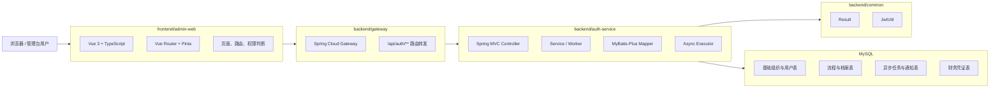

# 开发架构与线程分布

> 版本：v1.1  
> 日期：2026-03-27  
> 范围：基于当前仓库真实代码状态

## 1. 当前开发架构

当前系统是一个“单前端管理台 + 网关 + 单业务服务 + MySQL”的分层架构。



## 2. 模块职责

- `frontend/admin-web`：登录、首页、发票、报销、流程管理、系统设置、凭证录入等页面
- `backend/gateway`：统一 API 入口与路由转发
- `backend/auth-service`：当前主业务服务，承载认证、MVP 数据、流程、异步任务、系统设置、凭证等能力
- `backend/common`：统一响应、JWT 等公共能力
- `backend/sql`：初始化脚本、升级脚本、刷新脚本

## 3. 典型请求链路

以“已登录用户访问发票列表”为例：

```text
浏览器页面
-> src/api/index.ts 发起请求
-> /api/auth/invoices
-> gateway 路由转发
-> auth-service
-> AuthInterceptor 校验 JWT
-> MvpController.invoices()
-> MvpDataService
-> Mapper / MySQL
-> Result.success(...)
-> 前端页面渲染
```

以“提交发票 OCR 任务”为例：

```text
浏览器页面
-> /api/auth/async-tasks/invoices/ocr
-> gateway
-> auth-service
-> AuthInterceptor
-> AsyncTaskController.ocrInvoice()
-> AsyncTaskService.submitInvoiceOcr()
-> 写入 sys_async_task
-> AsyncTaskWorker.runInvoiceOcrTask() 异步执行
-> NotificationService 异步写入通知
```

## 4. 当前线程分布

### 4.1 前端

- 浏览器主线程：页面渲染、交互、路由切换、状态更新
- 浏览器网络线程：`fetch` 请求由浏览器底层处理，结果再回到主线程

当前前端没有引入：

- Web Worker
- Service Worker

### 4.2 Gateway

`gateway` 使用的是响应式网关，主要依赖：

- Netty 线程
- Reactor 事件循环线程

当前 gateway 主要负责轻量路由，不承载复杂业务编排。

### 4.3 auth-service 请求线程

`auth-service` 使用 `spring-boot-starter-web`，主业务链路仍然是典型的 Servlet / Tomcat 模型：

1. Tomcat 接收请求
2. 分配一个工作线程
3. 在同一条请求线程内执行：
   - `AuthInterceptor`
   - Controller
   - Service
   - Mapper
4. 返回 JSON 响应

### 4.4 auth-service 异步线程

当前仓库已经具备独立异步执行器：

- 线程池 Bean：`finexAsyncExecutor`
- 配置入口：`backend/auth-service/src/main/java/com/finex/auth/config/AsyncTaskConfig.java`
- 默认线程名前缀：`finex-async-`

已经拆为异步执行的能力包括：

- 下载导出
- 发票验真
- 发票 OCR
- 通知发送

这些任务由 `AsyncTaskWorker` 和 `NotificationServiceImpl` 通过 `@Async("finexAsyncExecutor")` 执行。

### 4.5 数据库线程与连接

- 应用侧通过 JDBC / 连接池访问 MySQL
- SQL 执行最终由 MySQL 服务端线程处理

因此“请求线程”和“数据库线程”不是同一层概念：

- 应用侧请求线程负责业务编排
- 数据库侧线程负责 SQL 实际执行

## 5. 当前架构结论

当前项目已经不是“纯同步 MVP”，因为异步任务框架已经落地。

更准确的判断应该是：

- 前台链路仍以同步请求线程为主
- 高耗时的下载导出、发票验真、OCR、通知已开始拆入异步线程池
- 系统仍然是单业务服务承载多领域能力，尚未进入多服务拆分阶段

## 6. 目前仍存在的瓶颈

- `auth-service` 仍承载过多领域职责
- 仍有不少业务查询和聚合逻辑运行在同步请求线程中
- 当前没有引入消息队列、Redis、对象存储等更完整的平台能力
- 测试基线刚建立，回归保护还需要继续扩充

## 7. 建议的下一步

1. 继续补核心业务测试，优先覆盖登录、流程管理、发票、系统设置、凭证
2. 把新功能严格放入既定领域边界，避免继续堆进单一 controller
3. 为异步任务补充失败告警、重试策略和监控点
4. 在业务闭环稳定后，再评估是否拆出独立服务
