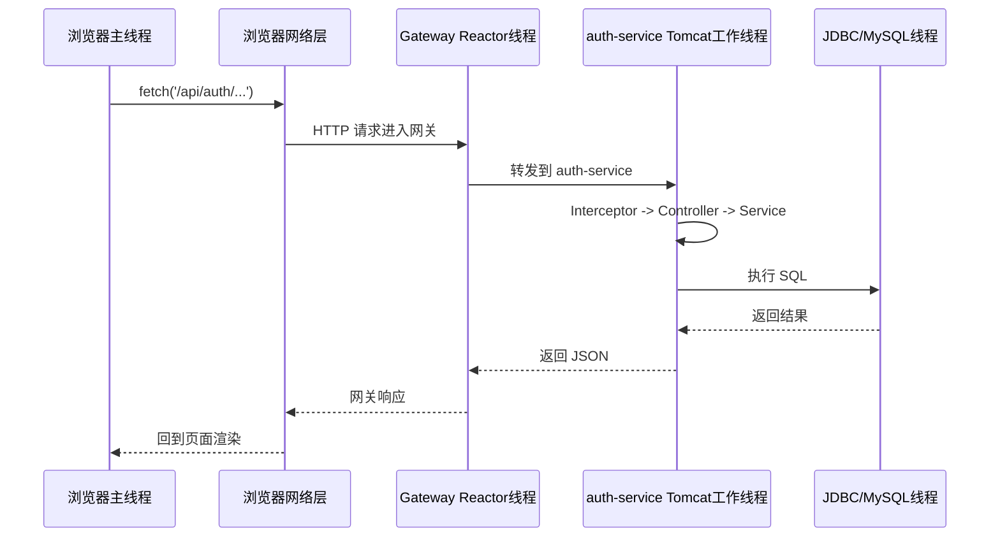

# 开发架构与线程分布

> 版本：v1.0  
> 日期：2026-03-25  
> 范围：基于当前仓库实际代码，而不是远期目标蓝图

## 1. 文档目的

这份文档用于回答两个问题：

1. 当前项目实际采用了什么开发架构。
2. 当前项目运行时，请求会经过哪些线程与执行层。

结合当前仓库，可以把系统定义为：

> 单前端管理台 + API 网关 + 单业务服务 + 公共工具模块 + MySQL 的轻量分层架构。

它已经具备登录、首页、报销列表、发票列表、流程管理、个人中心等 MVP 能力，但还没有进入完整多微服务、多中间件、异步任务化阶段。

---

## 2. 当前开发架构

### 2.1 仓库结构

```text
报销系统/
├─ frontend/
│  └─ admin-web/                 # Vue 3 管理台
├─ backend/
│  ├─ common/                    # Result、JWT 等公共能力
│  ├─ gateway/                   # Spring Cloud Gateway
│  ├─ auth-service/              # 当前唯一真实业务服务
│  └─ sql/                       # 初始化脚本与库表结构
├─ docs/
│  └─ architecture/
└─ README.md
```

### 2.2 架构分层

```mermaid
flowchart LR
    U["浏览器 / 财务用户"]

    subgraph FE["前端：admin-web"]
        FE1["Vue 3 + TypeScript"]
        FE2["Vue Router"]
        FE3["MainLayout + 业务页面"]
        FE4["fetch API 封装"]
    end

    subgraph GW["网关：gateway"]
        GW1["Spring Cloud Gateway"]
        GW2["/api/auth/** 路由转发"]
    end

    subgraph BE["业务服务：auth-service"]
        BE1["Spring Boot + Spring MVC"]
        BE2["AuthInterceptor"]
        BE3["Controller"]
        BE4["Service"]
        BE5["MyBatis-Plus Mapper"]
    end

    subgraph CM["公共模块：common"]
        CM1["Result"]
        CM2["JwtUtil"]
    end

    subgraph DB["数据层：MySQL"]
        DB1["sys_user"]
        DB2["sys_user_bank_account"]
        DB3["sys_download_record"]
        DB4["pm_template_category"]
        DB5["pm_document_template"]
        DB6["pm_template_scope"]
    end

    U --> FE
    FE --> GW
    GW --> BE
    BE --> CM
    BE --> DB
```



### 2.3 模块职责

| 层级 | 模块 | 当前职责 |
|---|---|---|
| 前端展示层 | `frontend/admin-web` | 登录、首页、报销列表、发票列表、流程管理、个人中心、下载中心等页面 |
| 前端接入层 | `src/api/index.ts` | 统一封装 `fetch`、拼接 `/api` 前缀、注入 Token、处理 401 |
| 网关层 | `backend/gateway` | 接收 `/api/auth/**` 请求并转发到 `auth-service` |
| 业务层 | `backend/auth-service` | 认证、MVP 数据、流程管理、个人中心 |
| 公共层 | `backend/common` | 统一响应结构、JWT 生成与校验 |
| 数据层 | `backend/sql` + MySQL | 用户、收款账户、下载记录、流程模板等数据持久化 |

### 2.4 当前前端结构

前端是单应用管理台，不存在多前端拆分。当前结构特点如下：

- 入口统一由 `src/main.ts` 启动，注册 Pinia、Router、Element Plus。
- 菜单框架集中在 `src/layouts/MainLayout.vue`。
- 路由统一在 `src/router/index.ts` 中定义。
- API 请求统一走 `src/api/index.ts`。
- 页面层已经比后端能力走得更快，部分页面仍是占位页或半动态页。

当前前端业务分区可以归纳为：

- 认证区：登录、当前用户信息。
- 报销区：新建报销、我的报销、待我审批、支付、单据查询、凭证生成。
- 流程工作台：流程管理、模板创建、预算管理。
- 财务区：总账、报表、固定资产、会计档案。
- 个人中心区：个人资料、密码、收款账户、下载中心。

### 2.5 当前后端结构

后端虽然采用 Maven 多模块，但当前真正承载业务的服务只有一个：`auth-service`。

#### `common`

- `Result`：统一响应包装。
- `JwtUtil`：Token 生成、校验、解析。

#### `gateway`

- 基于 Spring Cloud Gateway。
- 当前只配置了 `/api/auth/** -> http://localhost:8081` 一条核心路由。
- 属于“统一入口已建立，但治理能力尚未展开”的阶段。

#### `auth-service`

当前服务内部已经形成典型的 MVC 分层：

- `AuthController`：登录。
- `MvpController`：首页、当前用户、报销列表、发票列表。
- `ProcessManagementController`：流程管理概览、模板类型、表单选项、模板保存。
- `UserCenterController`：个人中心、下载中心、修改密码。
- `AuthInterceptor`：解析和校验 JWT，并把用户信息挂到请求上下文。
- `GlobalExceptionHandler`：统一处理参数与业务异常。
- `ServiceImpl`：承接业务编排。
- `Mapper`：通过 MyBatis-Plus 访问数据库。

### 2.6 当前接口调用链

以“已登录用户访问首页”为例，链路如下：

```text
浏览器页面
-> src/api/index.ts 发起 fetch
-> /api/auth/dashboard
-> gateway 路由转发
-> auth-service 接收请求
-> AuthInterceptor 校验 JWT
-> MvpController.dashboard()
-> MvpDataServiceImpl.getDashboard()
-> UserService / Mapper 查询用户
-> 组装 DashboardVO
-> Result.success(...) 返回前端
```

以“流程模板保存”为例，链路如下：

```text
浏览器页面
-> processApi.createTemplate()
-> /api/auth/process-management/templates
-> gateway
-> auth-service
-> AuthInterceptor
-> ProcessManagementController.createTemplate()
-> ProcessManagementServiceImpl.saveTemplate()
-> pm_document_template / pm_template_scope 落库
-> 返回模板编号与状态
```

---

## 3. 当前线程分布

## 3.1 总体判断

当前系统线程模型不是复杂的多线程并发架构，而是：

> 浏览器主线程 + Gateway Reactor 事件循环线程 + Spring MVC/Tomcat 请求线程 + JDBC/数据库执行线程

系统里暂时没有看到这些能力：

- 自定义业务线程池
- `@Async` 异步任务
- `@Scheduled` 定时任务
- 消息队列消费者线程
- OCR/验真/导出专用后台任务线程
- Web Worker / Service Worker

也就是说，当前大多数业务仍然是“同步请求、同步返回”的执行模型。

## 3.2 前端线程分布

前端运行在线程上的分布比较简单：

| 线程/执行单元 | 当前情况 | 说明 |
|---|---|---|
| 浏览器主线程 | 是 | Vue 渲染、路由切换、点击事件、状态更新都在这里执行 |
| 浏览器网络线程 | 是 | `fetch` 请求由浏览器底层处理，结果再回到主线程 |
| Web Worker | 否 | 当前没有发现任何 Worker 拆分 |
| Service Worker | 否 | 当前没有 PWA/离线缓存能力 |

这意味着：

- 页面交互与渲染都依赖主线程。
- 当前前端没有把复杂计算拆到独立线程。
- 一旦后续增加大体量表格导出、OCR 结果比对、复杂图表计算，前端可能需要 Worker 化。

## 3.3 Gateway 线程分布

`gateway` 配置了：

- `spring.main.web-application-type: reactive`
- Spring Cloud Gateway

因此它属于响应式网关，运行时主要依赖：

- Netty Boss/Worker 线程
- Reactor 事件循环线程

当前网关承担的工作很轻：

- 接收 HTTP 请求
- 匹配 `/api/auth/**`
- 执行 `StripPrefix=1`
- 转发到 `auth-service`

当前线程特点：

- 网关线程本身不承载复杂业务逻辑。
- 它更像“入口接待 + 路由转发层”。
- 当前没有自定义过滤器、限流器、熔断器，也没有额外线程池。

## 3.4 `auth-service` 线程分布

`auth-service` 使用 `spring-boot-starter-web`，因此当前是典型的 Spring MVC Servlet 模型。

这意味着每个请求的大致线程表现为：

1. Tomcat 接收请求。
2. 分配一个工作线程处理本次请求。
3. 同一条工作线程依次执行：
   - `AuthInterceptor.preHandle`
   - Controller
   - Service
   - Mapper
   - 响应序列化
4. 响应返回后，该工作线程归还线程池。

也就是说，当前 `auth-service` 里的主业务执行基本是：

> 一个请求，对应一条 Servlet 工作线程，同步走完整条调用链。

这也是当前系统“线程分布”最核心的特点。

## 3.5 数据库线程与连接分布

当前数据库是 MySQL，代码中使用 MyBatis-Plus。

基于 Spring Boot 的默认行为，并结合当前 `application.yml` 中没有显式指定别的数据源实现，可以合理推断：

- 应用侧默认使用 HikariCP 连接池。
- 每个请求线程在需要查库时，从连接池获取连接。
- SQL 真正执行在线程层面会进一步进入 MySQL 服务端的连接/执行线程。

这里需要强调：

> “请求线程”和“数据库线程”不是同一层概念。

应用视角下：

- Tomcat 工作线程负责业务调用。
- JDBC 驱动负责发起数据库交互。

数据库视角下：

- MySQL 服务端再用自己的连接与执行线程处理 SQL。

## 3.6 当前完整线程切换路径

可以把一次典型请求理解成下面这条执行路径：



## 3.7 当前线程模型的优点

- 简单，容易定位问题。
- 链路短，联调成本低。
- 没有异步一致性和线程池治理负担。
- 很适合当前 MVP 阶段快速交付。

## 3.8 当前线程模型的限制

- 所有业务大多是同步执行，容易被慢 SQL 或慢接口拖住。
- 没有把下载、验真、OCR、通知等任务从请求线程中剥离出去。
- 网关是响应式的，但下游仍是阻塞式 MVC 服务，整体不是端到端响应式。
- 一旦后续增加文件上传、发票识别、批量导出，Tomcat 工作线程会成为明显瓶颈。

---

## 4. 当前架构结论

当前项目最准确的架构结论是：

1. 前端是单体管理台架构。
2. 后端是“网关 + 单业务服务”的过渡期架构。
3. 业务模块虽然已经按认证、MVP 数据、流程管理、个人中心做了代码分区，但部署上仍是单服务承载。
4. 线程模型仍以同步请求线程为主，没有形成任务异步化和后台线程池治理。

因此当前项目适合的定位不是“完整微服务系统”，而是：

> 已具备管理后台雏形、正在向真实业务闭环演进的 MVP 阶段架构。

---

## 5. 后续演进建议

如果你后面要继续推进，我建议按下面顺序演进：

1. 先继续保持当前部署形态，把报销、发票、审批主链路补齐。
2. 在 `auth-service` 内先按领域进一步分包，而不是立刻拆成多个微服务。
3. 优先把“下载导出、发票验真、OCR、通知”拆成异步任务，减少请求线程阻塞。
4. 再引入 Redis、消息队列、对象存储，承接高频缓存和后台任务。
5. 等领域边界稳定后，再考虑拆分 `expense-service`、`invoice-service`、`process-service`。

一句话总结：

> 当前最重要的不是继续画更大的系统蓝图，而是把同步主链路做实，再把高耗时环节异步化。
