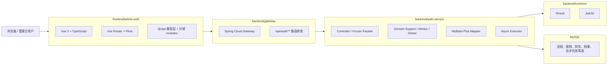

# 开发架构与线程分布

版本：v2.0  
日期：2026-04-11  
范围：基于当前仓库真实代码状态

## 1. 当前开发架构

当前系统是“前端管理台 + 网关 + 单体主服务 + MySQL”的结构，但 `auth-service` 内部已经形成多个领域 owner。



## 2. 当前模块职责

- `frontend/admin-web`：登录、首页、报销、流程、财务、固定资产、系统设置、archive-agent 等页面
- `backend/gateway`：统一 API 入口与路由转发
- `backend/auth-service`：单体主服务，承载 auth/profile/process/async-task/voucher/settings/mvp/finance/expense/fixed-asset/archive-agent 等子域
- `backend/common`：统一返回、JWT 等共享能力
- `backend/sql`：初始化、迁移、刷新脚本

## 3. 典型请求链路

### 3.1 查询型链路

```text
浏览器页面
-> src/api/index.ts 或分域 modules 发起请求
-> /api/auth/**
-> gateway
-> auth-service
-> AuthInterceptor
-> Controller
-> frozen facade / domain support
-> Mapper / MySQL
-> Result.success(...)
-> 前端页面渲染
```

### 3.2 异步型链路

```text
浏览器页面
-> /api/auth/async-tasks/** 或 archive-agent / payment 等入口
-> gateway
-> auth-service
-> Controller
-> domain support / worker
-> 写入任务或运行记录
-> finexAsyncExecutor / archive-agent worker 执行
-> 通知、日志、状态更新
```

## 4. 当前线程分布

### 4.1 前端

- 浏览器主线程：页面渲染、交互、路由切换、状态更新
- 浏览器网络线程：`fetch` 请求底层处理

当前前端未引入 Web Worker / Service Worker 作为主链路依赖。

### 4.2 gateway

`gateway` 继续采用响应式网关线程模型，主要依赖：

- Netty 线程
- Reactor 事件循环线程

当前 gateway 只做轻量路由，不承载复杂业务编排。

### 4.3 auth-service 请求线程

`auth-service` 仍是典型 Servlet / Tomcat 模型：

1. Tomcat 接收请求
2. 分配工作线程
3. 在线程内执行 `AuthInterceptor -> Controller -> Facade/Owner -> Mapper`
4. 返回 JSON 响应

### 4.4 auth-service 异步线程

当前独立异步执行器仍为：

- Bean：`finexAsyncExecutor`
- 配置类：`backend/auth-service/src/main/java/com/finex/auth/config/AsyncTaskConfig.java`
- 线程名前缀：`finex-async-`

已明确异步化的能力包括：

- 下载导出
- 发票 OCR / 验真
- 通知发送
- archive-agent 运行调度投递
- 其他 domain 中的显式异步任务

### 4.5 数据库线程与连接

- 应用侧通过 JDBC / 连接池访问 MySQL
- MySQL 服务端线程负责 SQL 实际执行

请求线程与数据库线程不是同一概念：

- 请求线程负责业务编排
- 数据库线程负责存储执行

## 5. 当前架构结论

当前最准确的判断是：

- 主链路不再是“早期同步 MVP”
- 单体主服务内部已经形成大量领域 owner
- 第一轮热点已收口，当前瓶颈转为少数 residual hotspot

## 6. 当前 residual 热点排序

根据当前仓库复盘，下一批建议顺位：

1. `ProcessFlowDesignServiceImpl`
2. `ExpensePaymentDomainSupport`
3. `ExpenseRelationWriteOffService`
4. `ExpenseSummaryAssembler`

补充说明：

- `AbstractExpenseDocumentSupport`、`AbstractExpenseWorkflowSupport` 等大基座虽然体量大，但当前不作为下一批目标
- 原因不是它们不重要，而是 live truth 已经比以前更集中在 owner，继续优先打 live hotspot 收益更高

## 7. 建议的下一步

1. 先收 `ProcessFlowDesignServiceImpl`，完成 process 域 second-wave 第一批
2. 再收 `ExpensePaymentDomainSupport`
3. 继续处理 `ExpenseRelationWriteOffService`
4. 最后处理 `ExpenseSummaryAssembler`
5. 完成后再做新一轮 backend residual 复盘，而不是预写更后面的具体类名
