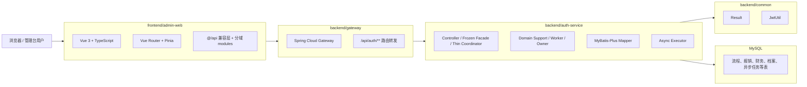

# 开发架构与线程分布

版本：V2.1
日期：2026-04-24
范围：基于当前仓库真实代码状态。

## 1. 当前开发架构

当前系统是“前端管理台 + 网关 + 单体主服务 + MySQL”的结构，但 `auth-service` 内部已经形成多子域 owner。


```mermaid
flowchart LR
    U["浏览器 / 管理台用户"]

    subgraph FE["frontend/admin-web"]
        FE1["Vue 3 + TypeScript"]
        FE2["Vue Router + Pinia"]
        FE3["@/api 兼容层 + 分域 modules"]
    end

    subgraph GW["backend/gateway"]
        GW1["Spring Cloud Gateway"]
        GW2["/api/auth/** 路由转发"]
    end

    subgraph BE["backend/auth-service"]
        BE1["Controller / Frozen Facade / Thin Coordinator"]
        BE2["Domain Support / Worker / Owner"]
        BE3["MyBatis-Plus Mapper"]
        BE4["Async Executor"]
    end

    subgraph CM["backend/common"]
        CM1["Result"]
        CM2["JwtUtil"]
    end

    subgraph DB["MySQL"]
        DB1["流程、报销、财务、档案、异步任务等表"]
    end

    U --> FE
    FE --> GW
    GW --> BE
    BE --> CM
    BE --> DB
```

## 2. 当前模块职责

- `frontend/admin-web`：登录、首页、报销、流程、财务、固定资产、系统设置、archive-agent 等页面
- `backend/gateway`：统一 API 入口与路由转发
- `backend/auth-service`：单体主服务，承载多子域业务
- `backend/common`：统一返回、JWT 与公共工具
- `backend/sql`：初始化、迁移与刷新脚本

## 3. 典型请求链路

### 3.1 查询链路

```text
浏览器页面
-> 前端 API module
-> /api/auth/**
-> gateway
-> auth-service
-> AuthInterceptor
-> Controller
-> Facade / Thin Coordinator / Owner
-> Mapper / MySQL
-> Result.success(...)
-> 前端页面渲染
```

### 3.2 异步链路

```text
浏览器页面
-> /api/auth/async-tasks/** 或 payment / archive-agent 等入口
-> gateway
-> auth-service
-> Controller
-> domain support / worker
-> 写入任务或运行记录
-> finexAsyncExecutor / 对应 worker 执行
-> 通知、日志、状态更新
```

## 4. 当前线程分布

### 4.1 前端

- 浏览器主线程：页面渲染、交互、路由切换、状态更新
- 浏览器网络线程：`fetch` / `XMLHttpRequest` 底层处理

当前前端未把 Web Worker / Service Worker 作为主链路依赖。

### 4.2 gateway

`gateway` 继续采用响应式网关线程模型，主要依赖：

- Netty 线程
- Reactor 事件循环线程

当前 gateway 只做轻量路由与转发，不承载复杂业务编排。

### 4.3 auth-service 请求线程

`auth-service` 仍是典型 Servlet / Tomcat 模型：

1. Tomcat 接收请求
2. 分配工作线程
3. 在线程内执行 `AuthInterceptor -> Controller -> Facade / Owner -> Mapper`
4. 返回 JSON 响应

### 4.4 auth-service 异步线程

当前独立异步执行器仍为：

- Bean：`finexAsyncExecutor`
- 配置类：`backend/auth-service/src/main/java/com/finex/auth/config/AsyncTaskConfig.java`
- 线程名前缀：`finex-async-`

已明确异步化的能力包括：

- 下载导出
- 发票 OCR / 验真
- 通知发送
- archive-agent 调度与运行
- 其他 domain 中的显式异步任务

### 4.5 数据库线程与连接

- 应用侧通过 JDBC / 连接池访问 MySQL
- MySQL 服务端线程负责 SQL 实际执行

请求线程与数据库线程不是同一个概念：

- 请求线程负责业务编排
- 数据库线程负责存储执行

## 5. 当前架构结论

当前最准确的判断是：

- 主链路不再是“早期同步 MVP”
- 单体主服务内部已经形成大量领域 owner
- 当前瓶颈已经从“有没有模块”转成“如何持续压制 residual hotspot 与工程漂移”

## 6. 当前治理状态

当前 second-wave 已完成的后端热点：

- `ProcessFlowDesignServiceImpl`
- `ExpensePaymentDomainSupport`
- `ExpenseRelationWriteOffService`
- `ExpenseSummaryAssembler`

当前下一步：

1. 回到全项目 hotspot 扫描与 residual re-rank
2. 再决定是继续处理 backend 大基座，还是切回前端大页面与工程文档治理