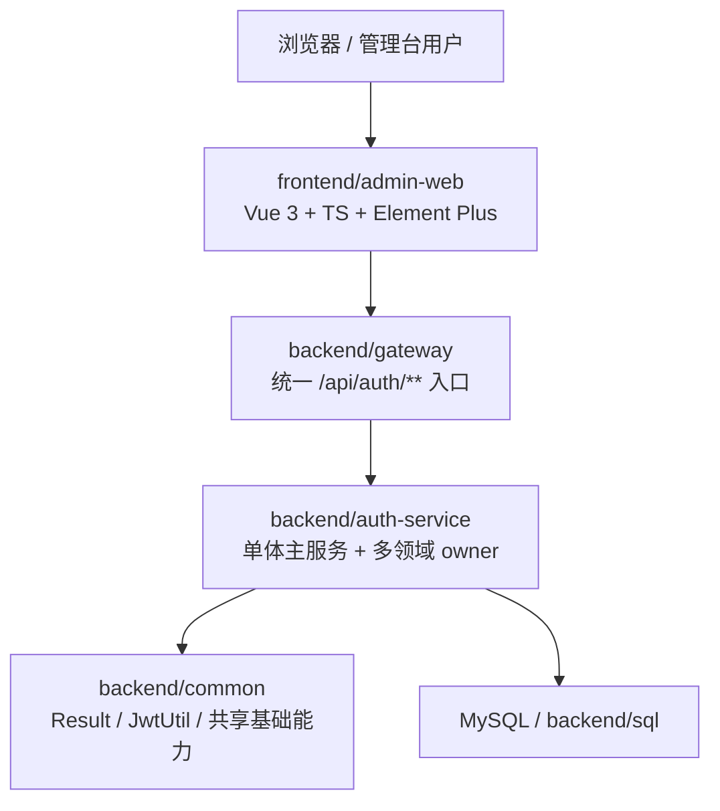
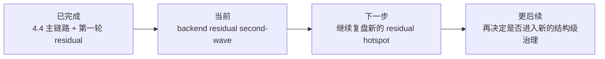

# 财务记账与报销一体化系统 - 系统架构设计

版本：v2.0  
日期：2026-04-11  
说明：本版仅做当前仓库事实对齐，不再沿用“早期 MVP 打通中”的旧口径。

## 1. 文档目的

这份文档同时回答三个问题：

1. 当前仓库已经落地成什么样子；
2. 当前架构的主要矛盾是什么；
3. 下一阶段应该继续收哪批 residual hotspot。

## 2. 当前系统架构

### 2.1 当前部署形态

### 2.2 当前后端内部形态

`auth-service` 当前已经不是“认证服务”单义角色，而是承载多数业务域的单体主服务：

- `auth`
- `profile`
- `process`
- `async-task`
- `voucher`
- `settings`
- `mvp-dashboard`
- `financesystem`
- `financearchive`
- `expense residual`
- `fixedasset`
- `expensevoucher`
- `archiveagent`

其中大量历史 mega service 已被压成 frozen facade / compatibility facade，live truth 正在 owner 中收口。

## 3. 当前真实状态判断

### 3.1 已完成的阶段

当前已经完成：

- `4.4` 主链路治理
- finance archive 收口
- expense residual 第一轮收口
- fixed-asset residual 首批收口
- expense-voucher-generation residual 收口
- archive-agent residual 收口

### 3.2 当前验证基线

- backend：`297/297`
- frontend：`211/211`

### 3.3 当前阶段

当前项目不再处于“从零到 MVP”的阶段，而处于：

> 单体主服务内部边界已经成型，正在继续清理 residual hotspot 的阶段。

## 4. 架构约束

### 4.1 当前不做的事

- 不激进重命名
- 不先拆微服务
- 不回头重打已形成 owner 的 `Abstract*Support` 大基座
- 不因为文档同步而改动业务协议

### 4.2 当前重点做的事

- 继续把 remaining hotspot 压成 thin facade 或窄 owner
- 保持 controller URL、service 接口、DTO/VO 稳定
- 持续维护 focused tests 与总回归基线
- 让 README、架构文档、配置样例、进度文档和仓库现状保持一致

## 5. 当前主要差距

与理想的长期蓝图相比，当前真正的差距已从“有没有业务模块”变成：

- 单体内部少数热点仍集中承载 live truth
- 某些读写聚合仍偏重
- residual 批次排序需要持续复盘，而不是凭感觉指定
- 文档和配置说明需要持续跟随最新治理基线

## 6. 下一阶段建议

当前 residual second-wave 顺位：

1. `ProcessFlowDesignServiceImpl`
2. `ExpensePaymentDomainSupport`
3. `ExpenseRelationWriteOffService`
4. `ExpenseSummaryAssembler`

推荐原因：

- 这 4 个类仍然是当前仓库里最明显的 live residual hotspot
- 它们都比重新回头收 `Abstract*Support` 更有即时治理收益
- 与已冻结 façade 的边界关系清晰，适合继续沿用现有收口模式

## 7. 中短期路线

## 8. 结论

当前最重要的架构判断是：

- 系统已经具备较完整的业务单体骨架；
- 现阶段的核心工作不是继续描述早期蓝图，而是继续做单体内部 residual 治理；
- 当前一切“下一步”都应以 `执行记录/报销系统治理落地方案.md` 为唯一进度基线。
