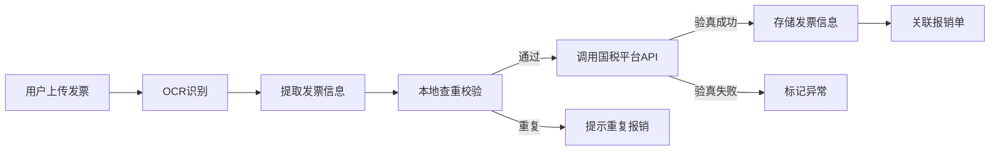

# 财务记账与报销一体化系统 - 架构设计文档

> 版本: v1.0  
> 日期: 2026-03-23  
> 作者: AI Assistant

---

## 目录

1. [项目概述](#1-项目概述)
2. [系统架构总览](#2-系统架构总览)
3. [技术栈选型](#3-技术栈选型)
4. [核心模块设计](#4-核心模块设计)
5. [数据库设计](#5-数据库设计)
6. [开发流程规划](#6-开发流程规划)
7. [项目文件结构](#7-项目文件结构)
8. [风险与注意事项](#8-风险与注意事项)

---

## 1. 项目概述

### 1.1 项目背景
企业需要一个集成化的财务管理系统，实现从费用申请、发票管理、审批流程到财务凭证生成的全流程数字化管理。

### 1.2 核心功能需求

| 序号 | 功能模块 | 功能描述 |
|------|----------|----------|
| 1 | **发票查重验真** | OCR识别发票信息，对接国税平台验真，本地查重校验 |
| 2 | **银企直连** | 对接银行网银系统，实现付款指令发送、回单获取、流水同步 |
| 3 | **凭证生成** | 根据报销数据自动生成会计凭证，支持对接金蝶/用友等财务软件 |
| 4 | **审批流程** | 可视化流程设计器，支持条件分支、会签/或签、超时提醒等 |
| 5 | **组织架构同步** | 预留企微、钉钉接口，同步部门、用户、权限信息 |

### 1.3 部署环境
- **云服务商**: 阿里云
- **部署方式**: 容器化部署（Kubernetes）

---

## 2. 系统架构总览

### 2.1 整体架构图

```
┌─────────────────────────────────────────────────────────────────────────────┐
│                              接入层 (Access Layer)                           │
├─────────────┬─────────────┬─────────────┬─────────────────────────────────────┤
│   Web PC    │   Web H5    │  企微小程序  │           钉钉应用                   │
│   (Vue3)    │   (Vue3)    │  (原生/Taro) │         (原生/UniApp)               │
└──────┬──────┴──────┬──────┴──────┬──────┴─────────────┬───────────────────────┘
       │             │             │                    │
       └─────────────┴─────────────┴────────────────────┘
                          │
                          ▼
┌─────────────────────────────────────────────────────────────────────────────┐
│                            网关层 (Gateway Layer)                            │
│  ┌─────────────┐  ┌─────────────┐  ┌─────────────┐  ┌─────────────────────┐ │
│  │ 阿里云SLB   │  │  Spring Cloud │  │   JWT认证   │  │    限流/熔断/降级    │ │
│  │  (负载均衡)  │──│   Gateway   │──│  + RBAC权限  │  │    (Sentinel)       │ │
│  └─────────────┘  └─────────────┘  └─────────────┘  └─────────────────────┘ │
└─────────────────────────────────────────────────────────────────────────────┘
                          │
                          ▼
┌─────────────────────────────────────────────────────────────────────────────┐
│                            业务层 (Service Layer)                            │
│  ┌──────────┐ ┌──────────┐ ┌──────────┐ ┌──────────┐ ┌──────────────────┐  │
│  │ 用户中心  │ │ 发票管理  │ │ 报销管理  │ │ 审批引擎  │ │    凭证生成       │  │
│  │  (SSO)   │ │ OCR+验真 │ │ 费用控制  │ │ 流程编排  │ │  会计引擎/金蝶    │  │
│  └──────────┘ └──────────┘ └──────────┘ └──────────┘ └──────────────────┘  │
│  ┌──────────┐ ┌──────────┐ ┌──────────┐ ┌──────────┐ ┌──────────────────┐  │
│  │ 银企直连  │ │ 预算管理  │ │ 组织架构  │ │ 通知中心  │ │    报表分析       │  │
│  │  网银SDK │ │ 多维度    │ │  同步接口  │ │ 企微/钉钉 │ │   BI/数据大屏    │  │
│  └──────────┘ └──────────┘ └──────────┘ └──────────┘ └──────────────────┘  │
└─────────────────────────────────────────────────────────────────────────────┘
                          │
                          ▼
┌─────────────────────────────────────────────────────────────────────────────┐
│                            数据层 (Data Layer)                               │
│  ┌──────────┐ ┌──────────┐ ┌──────────┐ ┌──────────┐ ┌──────────────────┐  │
│  │ 阿里云RDS │ │ 阿里云Redis│ │ 阿里云OSS │ │ 阿里云MQ  │ │   Elasticsearch  │  │
│  │ (MySQL 8)│ │  (缓存/锁) │ │ (文件存储) │ │ (RocketMQ)│ │  (发票搜索/日志)  │  │
│  └──────────┘ └──────────┘ └──────────┘ └──────────┘ └──────────────────┘  │
│  ┌────────────────────────────────────────────────────────────────────────┐ │
│  │                    阿里云MongoDB (发票结构存储/操作日志)                   │ │
│  └────────────────────────────────────────────────────────────────────────┘ │
└─────────────────────────────────────────────────────────────────────────────┘
                          │
                          ▼
┌─────────────────────────────────────────────────────────────────────────────┐
│                          外部接口层 (External APIs)                          │
│  ┌──────────────┐ ┌──────────────┐ ┌──────────────┐ ┌────────────────────┐ │
│  │  国家税务总局 │ │   银行网银    │ │    企微开放平台 │ │    钉钉开放平台     │ │
│  │  发票查验平台 │ │  (银企直联)   │ │   (组织架构)   │ │    (组织架构)      │ │
│  └──────────────┘ └──────────────┘ └──────────────┘ └────────────────────┘ │
│  ┌──────────────┐ ┌──────────────┐ ┌──────────────┐                        │
│  │   阿里云OCR   │ │  金蝶/用友   │ │  电子发票平台  │                        │
│  │  (发票识别)   │ │  (财务系统)   │ │  (百望/航信)  │                        │
│  └──────────────┘ └──────────────┘ └──────────────┘                        │
└─────────────────────────────────────────────────────────────────────────────┘
```

### 2.2 架构分层说明

| 层级 | 职责 | 核心组件 |
|------|------|----------|
| **接入层** | 多端统一接入 | Web、H5、小程序、钉钉 |
| **网关层** | 流量治理、安全认证 | SLB、Gateway、JWT、Sentinel |
| **业务层** | 核心业务逻辑 | 微服务集群 |
| **数据层** | 数据存储与缓存 | RDS、Redis、MongoDB、ES |
| **外部接口层** | 第三方系统对接 | 税务、银行、IM平台 |

---

## 3. 技术栈选型

### 3.1 前端技术栈

| 技术 | 版本 | 用途 |
|------|------|------|
| Vue | 3.4+ | 前端框架 |
| TypeScript | 5.x | 类型语言 |
| Element Plus | 2.5+ | UI组件库 |
| Tailwind CSS | 3.x | CSS框架 |
| Vite | 5.x | 构建工具 |
| Vue Router | 4.x | 路由管理 |
| Pinia | 2.x | 状态管理 |

### 3.2 后端技术栈

| 技术 | 版本 | 用途 |
|------|------|------|
| Java | 17 | 开发语言 |
| Spring Boot | 3.x | 主框架 |
| Spring Cloud Alibaba | 2022.x | 微服务治理 |
| MyBatis-Plus | 3.5+ | ORM框架 |
| Flowable/Camunda | 7.x | 工作流引擎 |
| XXL-Job | 2.4+ | 任务调度 |

### 3.3 基础设施（阿里云）

| 服务 | 用途 |
|------|------|
| ECS/ACK | 服务器/Kubernetes集群 |
| RDS MySQL 8.0 | 主数据库 |
| Redis 7.x | 缓存/分布式锁 |
| MongoDB | 发票原始数据/日志 |
| Elasticsearch | 搜索引擎 |
| OSS | 文件存储 |
| RocketMQ | 消息队列 |
| SLB | 负载均衡 |

---

## 4. 核心模块设计

### 4.1 发票管理模块

#### 4.1.1 功能架构

```
┌─────────────────────────────────────────────────────────┐
│                     发票管理模块                          │
├─────────────────────────────────────────────────────────┤
│  ┌──────────┐  ┌──────────┐  ┌──────────┐  ┌─────────┐ │
│  │ 发票录入  │  │ 发票识别  │  │ 查重验真  │  │ 发票归档 │ │
│  │ (手工/导入)│  │ (OCR识别) │  │ (国税接口)│  │ (分类)  │ │
│  └────┬─────┘  └────┬─────┘  └────┬─────┘  └────┬────┘ │
│       │             │             │             │      │
│       └─────────────┴──────┬──────┴─────────────┘      │
│                            ▼                          │
│                    ┌──────────────┐                   │
│                    │   发票池       │                   │
│                    │ (去重/状态管理) │                   │
│                    └──────────────┘                   │
└─────────────────────────────────────────────────────────┘
```

#### 4.1.2 发票验真流程



#### 4.1.3 查重规则

| 规则 | 说明 |
|------|------|
| 唯一键 | 发票代码 + 发票号码 + 开票日期 |
| 报销限制 | 同一张发票不能被多人报销 |
| 状态锁定 | 已报销发票不可再次使用 |

### 4.2 银企直连模块

#### 4.2.1 功能架构

```
┌────────────────────────────────────────────────────────────┐
│                      银企直连模块                             │
├────────────────────────────────────────────────────────────┤
│  ┌─────────────┐  ┌─────────────┐  ┌─────────────────────┐ │
│  │  银行接入层   │  │  交易处理层   │  │     资金管理         │ │
│  │             │  │             │  │                     │ │
│  │ • 招商银行   │  │ • 付款指令    │  │ • 账户余额查询       │ │
│  │ • 工商银行   │  │ • 批量代发    │  │ • 交易流水同步       │ │
│  │ • 建设银行   │  │ • 转账汇款    │  │ • 资金归集           │ │
│  │ • 平安银行   │  │ • 回单获取    │  │ • 银企对账           │ │
│  │ • ...       │  │             │  │                     │ │
│  └─────────────┘  └─────────────┘  └─────────────────────┘ │
│                                                             │
│  接入方式：                                                  │
│  • 银行直联SDK (推荐)                                        │
│  • 银企直联前置机                                            │
│  • SWIFT/网银接口                                            │
└────────────────────────────────────────────────────────────┘
```

### 4.3 审批引擎模块

#### 4.3.1 流程设计器

基于 Flowable/Camunda 实现，支持：

| 功能 | 说明 |
|------|------|
| 可视化设计 | 拖拽式流程设计器 |
| 条件分支 | 金额阈值、费用类型等条件 |
| 会签/或签 | 多人审批模式配置 |
| 超时处理 | 自动提醒、自动转交 |
| 流程版本 | 支持流程版本管理 |

#### 4.3.2 标准审批流程

```
┌──────┐    ┌──────┐    ┌──────┐    ┌──────┐    ┌──────┐
│ 提交  │───▶│ 直属 │───▶│ 部门 │───▶│ 财务 │───▶│ 出纳 │
│ 报销  │    │ 上级 │    │ 经理 │    │ 审核 │    │ 付款 │
└──────┘    └──────┘    └──────┘    └──────┘    └──────┘
```

### 4.4 凭证生成模块

#### 4.4.1 凭证模板配置

```
┌─────────────────────────────────────────────────────────────┐
│                      凭证生成模块                            │
├─────────────────────────────────────────────────────────────┤
│  ┌─────────────┐  ┌─────────────┐  ┌─────────────────────┐  │
│  │ 费用类型    │  │ 科目映射    │  │ 凭证分录模板         │  │
│  │             │  │             │  │                     │  │
│  │ • 差旅费    │──│ • 交通费    │──│ 借：管理费用-差旅费  │  │
│  │ • 办公费    │  │   → 6601    │  │ 贷：其他应付款-员工  │  │
│  │ • 招待费    │  │ • 餐费      │  │                     │  │
│  │ • ...      │  │   → 6602    │  │ 付款后：             │  │
│  │             │  │             │  │ 借：其他应付款-员工  │  │
│  │             │  │             │  │ 贷：银行存款         │  │
│  └─────────────┘  └─────────────┘  └─────────────────────┘  │
│                                                             │
│  对接财务软件：                                              │
│  • 金蝶云星空 API                                           │
│  • 用友 NC/U8 API                                          │
│  • 标准凭证导出 (Excel/TXT)                                 │
└─────────────────────────────────────────────────────────────┘
```

### 4.5 组织架构同步模块

```
┌─────────────────────────────────────────────────────────────┐
│                    组织架构同步模块                           │
├─────────────────────────────────────────────────────────────┤
│                                                             │
│   企微同步                    钉钉同步                        │
│   ┌─────────────┐            ┌─────────────┐               │
│   │ 部门同步    │            │ 部门同步    │               │
│   │ 用户同步    │            │ 用户同步    │               │
│   │ 标签同步    │            │ 角色同步    │               │
│   │ 通讯录权限  │            │ 通讯录权限  │               │
│   └──────┬──────┘            └──────┬──────┘               │
│          │                          │                       │
│          └──────────┬───────────────┘                       │
│                     ▼                                       │
│            ┌─────────────────┐                             │
│            │   统一用户中心    │                             │
│            │   (SSO/权限)     │                             │
│            └─────────────────┘                             │
│                                                             │
│   同步策略：                                                  │
│   • 定时全量同步 (每日凌晨)                                    │
│   • 实时增量同步 (Webhook回调)                                │
│   • 支持双向同步（可选）                                       │
└─────────────────────────────────────────────────────────────┘
```

---

## 5. 数据库设计

### 5.1 核心表结构

#### 5.1.1 用户表 (sys_user)

```sql
CREATE TABLE sys_user (
    id BIGINT PRIMARY KEY COMMENT '用户ID',
    username VARCHAR(50) UNIQUE COMMENT '用户名',
    name VARCHAR(50) COMMENT '姓名',
    phone VARCHAR(20) COMMENT '手机号',
    email VARCHAR(100) COMMENT '邮箱',
    dept_id BIGINT COMMENT '部门ID',
    position VARCHAR(50) COMMENT '职位',
    status TINYINT DEFAULT 1 COMMENT '状态：1正常 0禁用',
    wecom_userid VARCHAR(100) COMMENT '企微用户ID',
    dingtalk_userid VARCHAR(100) COMMENT '钉钉用户ID',
    created_at DATETIME COMMENT '创建时间',
    updated_at DATETIME COMMENT '更新时间',
    INDEX idx_dept (dept_id),
    INDEX idx_phone (phone)
) COMMENT='用户表';
```

#### 5.1.2 发票表 (invoice)

```sql
CREATE TABLE invoice (
    id BIGINT PRIMARY KEY COMMENT '发票ID',
    invoice_code VARCHAR(20) COMMENT '发票代码',
    invoice_number VARCHAR(20) COMMENT '发票号码',
    invoice_type VARCHAR(10) COMMENT '发票类型：专票/普票/电子',
    invoice_date DATE COMMENT '开票日期',
    buyer_name VARCHAR(200) COMMENT '购买方名称',
    buyer_tax_no VARCHAR(20) COMMENT '购买方税号',
    seller_name VARCHAR(200) COMMENT '销售方名称',
    seller_tax_no VARCHAR(20) COMMENT '销售方税号',
    amount DECIMAL(18,2) COMMENT '不含税金额',
    tax_amount DECIMAL(18,2) COMMENT '税额',
    total_amount DECIMAL(18,2) COMMENT '价税合计',
    check_status TINYINT COMMENT '验真状态：0待验真 1已验真 2验真失败',
    check_time DATETIME COMMENT '验真时间',
    ocr_data JSON COMMENT 'OCR识别原始数据',
    file_url VARCHAR(500) COMMENT '附件地址',
    created_by BIGINT COMMENT '创建人',
    created_at DATETIME COMMENT '创建时间',
    UNIQUE KEY uk_invoice (invoice_code, invoice_number, invoice_date),
    INDEX idx_seller (seller_tax_no),
    INDEX idx_date (invoice_date)
) COMMENT='发票表';
```

#### 5.1.3 报销单表 (expense_report)

```sql
CREATE TABLE expense_report (
    id BIGINT PRIMARY KEY COMMENT '报销单ID',
    report_no VARCHAR(30) COMMENT '报销单号',
    user_id BIGINT COMMENT '报销人ID',
    dept_id BIGINT COMMENT '部门ID',
    report_type TINYINT COMMENT '报销类型',
    total_amount DECIMAL(18,2) COMMENT '总金额',
    currency VARCHAR(10) DEFAULT 'CNY' COMMENT '币种',
    status TINYINT COMMENT '状态：0草稿 1审批中 2已通过 3已驳回',
    process_instance_id VARCHAR(50) COMMENT '流程实例ID',
    submit_time DATETIME COMMENT '提交时间',
    finish_time DATETIME COMMENT '完成时间',
    created_at DATETIME COMMENT '创建时间',
    updated_at DATETIME COMMENT '更新时间',
    INDEX idx_user (user_id),
    INDEX idx_status (status),
    INDEX idx_no (report_no)
) COMMENT='报销单表';
```

#### 5.1.4 报销明细表 (expense_item)

```sql
CREATE TABLE expense_item (
    id BIGINT PRIMARY KEY COMMENT '明细ID',
    report_id BIGINT COMMENT '报销单ID',
    expense_type VARCHAR(20) COMMENT '费用类型',
    amount DECIMAL(18,2) COMMENT '金额',
    invoice_id BIGINT COMMENT '关联发票ID',
    description VARCHAR(500) COMMENT '事由说明',
    occur_date DATE COMMENT '发生日期',
    attachments JSON COMMENT '附件列表',
    INDEX idx_report (report_id),
    INDEX idx_invoice (invoice_id)
) COMMENT='报销明细表';
```

#### 5.1.5 审批任务表 (approval_task)

```sql
CREATE TABLE approval_task (
    id BIGINT PRIMARY KEY COMMENT '任务ID',
    process_instance_id VARCHAR(50) COMMENT '流程实例ID',
    task_id VARCHAR(50) COMMENT '任务ID',
    task_name VARCHAR(100) COMMENT '任务名称',
    assignee_id BIGINT COMMENT '审批人ID',
    status TINYINT COMMENT '状态：0待处理 1已同意 2已驳回',
    comment VARCHAR(500) COMMENT '审批意见',
    start_time DATETIME COMMENT '开始时间',
    end_time DATETIME COMMENT '结束时间',
    INDEX idx_process (process_instance_id),
    INDEX idx_assignee (assignee_id),
    INDEX idx_status (status)
) COMMENT='审批任务表';
```

---

## 6. 开发流程规划

### 6.1 里程碑规划

```
┌──────────────────────────────────────────────────────────────────────────┐
│                           开发时间线 (20周)                               │
├─────────┬─────────┬─────────┬─────────┬─────────┬─────────────────────────┤
│  第1-2周 │  第3-8周 │ 第9-14周 │ 第15-17周│ 第18-20周│                        │
│ 基础搭建 │ 核心功能 │ 高级功能 │ 测试优化 │ 上线运维 │                        │
└─────────┴─────────┴─────────┴─────────┴─────────┴─────────────────────────┘
```

### 6.2 详细阶段划分

#### 阶段一：基础架构搭建（第1-2周）

| 任务 | 输出物 | 负责人 |
|------|--------|--------|
| 阿里云环境准备 | ECS/RDS/Redis/OSS开通配置 | 运维 |
| 开发环境搭建 | Git仓库、CI/CD流水线、开发规范 | 架构师 |
| 基础框架搭建 | Spring Boot项目骨架、统一响应、全局异常 | 后端 |
| 前端项目初始化 | Vue3项目、路由、权限、组件库 | 前端 |
| 数据库设计 | ER图、建表脚本、索引优化 | 架构师 |

**里程碑**: ✅ 基础框架可运行，团队开发环境就绪

#### 阶段二：核心功能开发（第3-8周）

**Sprint 1 (第3-4周)：用户与组织架构**
- [ ] 用户登录/注册/SSO
- [ ] RBAC权限管理
- [ ] 部门管理
- [ ] 企微/钉钉组织架构同步接口预留

**Sprint 2 (第5-6周)：发票管理**
- [ ] 发票OCR识别接入（阿里云OCR）
- [ ] 发票上传与存储
- [ ] 发票查重逻辑
- [ ] 发票验真接口对接（国税平台）

**Sprint 3 (第7-8周)：报销流程**
- [ ] 报销单CRUD
- [ ] 审批流引擎集成（Flowable）
- [ ] 可视化流程设计器
- [ ] 报销审批流程配置

**里程碑**: ✅ 报销流程可完整跑通

#### 阶段三：高级功能开发（第9-14周）

**Sprint 4 (第9-10周)：银企直连**
- [ ] 银行接口调研与选型
- [ ] 付款指令生成
- [ ] 银行回单获取
- [ ] 交易流水同步

**Sprint 5 (第11-12周)：凭证与财务对接**
- [ ] 会计科目配置
- [ ] 凭证模板配置
- [ ] 凭证自动生成
- [ ] 金蝶/用友对接接口

**Sprint 6 (第13-14周)：企微/钉钉集成**
- [ ] 企微应用创建与配置
- [ ] 钉钉应用创建与配置
- [ ] 消息通知推送
- [ ] 移动端H5/小程序开发

**里程碑**: ✅ 系统核心功能全部可用

#### 阶段四：测试与优化（第15-17周）

| 任务 | 说明 |
|------|------|
| 功能测试 | 全功能点覆盖测试 |
| 性能测试 | 并发报销、发票验真压力测试 |
| 安全测试 | 渗透测试、数据安全审计 |
| UAT测试 | 关键用户验收测试 |
| 文档编写 | 操作手册、API文档、部署文档 |

**里程碑**: ✅ 系统达到上线标准

#### 阶段五：上线与运维（第18-20周）

| 任务 | 说明 |
|------|------|
| 生产环境部署 | 阿里云生产环境配置 |
| 数据迁移 | 历史数据导入（如有） |
| 灰度发布 | 先小范围试用 |
| 培训推广 | 用户培训、问题收集 |
| 正式上线 | 全量用户开放 |

---

## 7. 项目文件结构

```
financial-expense-system/
├── 📁 docs/                          # 文档
│   ├── architecture/                 # 架构设计
│   ├── api/                          # API文档
│   └── deploy/                       # 部署文档
│
├── 📁 frontend/
│   ├── admin-web/                    # 管理后台 (Vue3)
│   └── mobile-h5/                    # 移动端H5 (UniApp)
│
├── 📁 backend/
│   ├── common/                       # 公共模块
│   │   ├── common-core/              # 核心工具
│   │   ├── common-security/          # 安全认证
│   │   └── common-mybatis/           # 数据访问
│   │
│   ├── gateway/                      # 网关服务
│   ├── auth-service/                 # 认证服务
│   ├── user-service/                 # 用户服务
│   ├── invoice-service/              # 发票服务
│   ├── expense-service/              # 报销服务
│   ├── approval-service/             # 审批服务
│   ├── bank-service/                 # 银企直连服务
│   ├── voucher-service/              # 凭证服务
│   └── report-service/               # 报表服务
│
├── 📁 infrastructure/
│   ├── docker/                       # Docker配置
│   ├── k8s/                          # K8s编排
│   └── sql/                          # 数据库脚本
│
└── 📁 third-party/
    ├── wecom-sdk/                    # 企微SDK封装
    └── dingtalk-sdk/                 # 钉钉SDK封装
```

---

## 8. 风险与注意事项

### 8.1 风险清单

| 风险点 | 影响 | 应对策略 |
|--------|------|----------|
| **发票验真接口限制** | 国税平台有QPS限制，高峰期可能失败 | 设计队列削峰，异步验真 |
| **银企直连对接周期长** | 银行审批流程长，影响上线时间 | 提前与银行沟通，申请测试环境 |
| **企微/钉钉接口变更** | 第三方平台API可能变动 | 封装SDK层，隔离第三方变化 |
| **财务数据安全** | 敏感数据泄露风险 | 字段加密、操作审计、等保合规 |
| **并发性能** | 报销高峰期集中提交 | 提前压测，优化数据库索引 |

### 8.2 合规要求

- **数据安全**: 敏感字段加密存储（AES/RSA）
- **操作审计**: 所有关键操作记录日志
- **等保合规**: 满足等保2.0/3.0要求
- **数据备份**: 定期备份，支持灾难恢复

### 8.3 性能指标

| 指标 | 目标值 |
|------|--------|
| 页面加载时间 | < 2秒 |
| API响应时间 | < 500ms |
| 并发用户数 | 1000+ |
| 发票识别速度 | < 3秒/张 |
| 系统可用性 | 99.9% |

---

## 附录

### A. 参考文档

- [Vue 3 官方文档](https://cn.vuejs.org)
- [Element Plus 文档](https://element-plus.org)
- [Spring Boot 文档](https://spring.io/projects/spring-boot)
- [Flowable 文档](https://www.flowable.com/open-source/docs)

### B. 版本历史

| 版本 | 日期 | 修改内容 |
|------|------|----------|
| v1.0 | 2026-03-23 | 初始版本 |

---

**文档结束**
