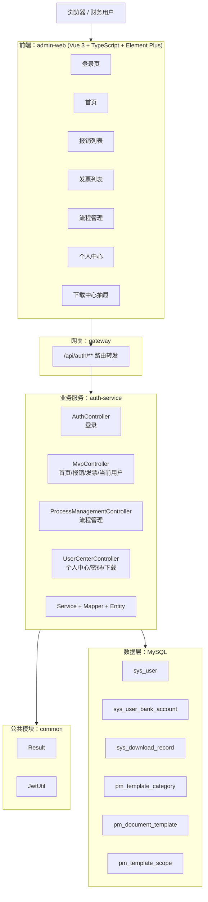

# 财务记账与报销一体化系统 - 架构设计与项目进度（修订版）

> 版本: v1.1  
> 日期: 2026-03-25  
> 说明: 本版基于当前代码仓库真实实现修订，已补充原蓝图对比、修订后蓝图和项目进度评估。

---

## 1. 文档目的

这份文档解决两个问题：

1. 原始架构蓝图描述了远期目标，但与当前代码实现存在明显差距。
2. 项目已经从“认证骨架”演进到“可登录、可进入动态页面、具备流程管理和个人中心雏形”的阶段，需要一份和代码一致的蓝图。

因此，本修订版同时覆盖：

- 原始蓝图的目标边界
- 当前项目真实落地情况
- 两者差距分析
- 修订后的可执行蓝图
- 项目进度判断

---

## 2. 当前项目状态概述

### 2.1 当前已落地模块

后端当前真实存在的模块：

- `backend/common`
- `backend/gateway`
- `backend/auth-service`
- `backend/sql`

前端当前真实存在的模块：

- `frontend/admin-web`

当前后端已经落地的控制器：

- `AuthController`
- `MvpController`
- `ProcessManagementController`
- `UserCenterController`

当前已落地的数据实体：

- `sys_user`
- `sys_user_bank_account`
- `sys_download_record`
- `pm_template_category`
- `pm_document_template`
- `pm_template_scope`

### 2.2 当前已实现能力

当前系统已经具备以下真实能力：

- 账号密码登录
- JWT 登录态校验
- 网关统一转发认证与业务接口
- 首页动态数据展示
- 我的报销动态列表
- 发票管理动态列表
- 流程管理工作台
- 单据模板类型选择与新建页面
- 个人中心
- 账号与安全
- 修改密码
- 收款账户展示
- 下载中心展示

### 2.3 当前阶段判断

当前项目已经不是“纯静态原型”，但也还不是“完整业务系统”。  
更准确的判断是：

> 当前处于“阶段 1.5：MVP 打通完成，正在进入业务配置中心与用户中心补齐阶段”。

---

## 3. 与原始蓝图的对比

### 3.1 原始蓝图定位

原始文档的定位偏向“远期完整平台”，主要特点是：

- 多端接入：Web、H5、企微、钉钉
- 多微服务拆分：用户、发票、报销、审批、银企直连、凭证、报表
- 多基础设施：Redis、MongoDB、OSS、MQ、ES、K8s
- 多外部对接：税务平台、银行、企微、钉钉、财务软件

### 3.2 当前真实情况

当前真实代码与原蓝图相比，差距如下：

| 维度 | 原始蓝图 | 当前真实实现 | 结论 |
|---|---|---|---|
| 前端接入 | Web/H5/企微/钉钉 | 仅 `admin-web` | 远低于蓝图 |
| 服务拆分 | 8+ 个业务服务 | `common + gateway + auth-service` | 仍为早期集中式实现 |
| 登录鉴权 | 完整 SSO / RBAC | 账号密码 + JWT + 路由守卫 | 已有基础能力 |
| 报销业务 | 完整报销闭环 | 首页/报销列表动态，创建页仍未完成 | 部分实现 |
| 发票业务 | OCR + 验真 + 查重 + 归档 | 发票列表动态展示 | 仍是 MVP 层 |
| 流程能力 | 审批引擎 + 流程编排 | 流程管理 UI + 模板配置保存 | 已进入配置中心阶段 |
| 用户中心 | 用户、权限、组织、账户 | 个人中心/安全/收款账户/下载记录 | 已实现首版 |
| 财务能力 | 凭证、总账、报表、银企直连 | 菜单已规划，业务未落地 | 基本未开始 |
| 基础设施 | Redis/MQ/OSS/ES/K8s | 目前主链路仅 MySQL | 尚未进入生产化阶段 |
| 外部集成 | 税务、银行、企微、钉钉、金蝶/用友 | 仅保留架构意图 | 尚未开始 |

### 3.3 结论

原始蓝图没有错，但它更像“目标全景图”，不适合作为当前阶段的执行蓝图。  
当前项目需要从“远期平台蓝图”切换为“近期可交付蓝图”。

---

## 4. 当前真实架构

### 4.1 当前实现架构图



### 4.2 当前架构特征

当前架构是典型的“单前端 + 单业务服务 + 网关 + 公共模块 + MySQL”的轻量方案。

优点：

- 简单可跑
- 联调成本低
- 文档、代码、数据库容易对齐
- 适合快速推进 MVP

限制：

- `auth-service` 已经承担登录、MVP 数据、流程管理、个人中心等多类职责
- 业务边界还未真正拆分
- 缺少缓存、文件存储、消息队列和任务调度
- 缺少真正的审批流、发票验真、凭证生成等核心业务闭环

---

## 5. 修订后的蓝图

### 5.1 修订原则

修订后的蓝图遵循以下原则：

1. 先让系统可用，再让系统完整。
2. 先围绕主链路打通，再扩展外围系统。
3. 在领域边界稳定前，不急于过早拆微服务。
4. 文档必须跟代码状态保持一致。

### 5.2 修订后的阶段蓝图

#### 阶段 A：MVP 已打通

目标：

- 登录成功
- 进入后台
- 首页动态展示
- 报销列表动态展示
- 发票列表动态展示
- 个人中心和下载中心可查看

当前状态：

- 已完成

#### 阶段 B：业务配置中心建设中

目标：

- 流程管理工作台可用
- 单据模板查看、选择、创建可完成
- 模板数据可持久化到 MySQL

当前状态：

- 已完成首版
- 已具备 UI、路由、后端接口、数据库表
- 仍缺少编辑、删除、发布、版本管理

#### 阶段 C：报销与发票业务闭环

目标：

- 新建报销单
- 保存草稿
- 提交审批
- 发票上传
- 发票绑定报销单
- 发票查重/验真预留

当前状态：

- 部分完成
- 列表已动态化
- 创建与提交流程仍未落地

#### 阶段 D：审批与财务主链路

目标：

- 待我审批
- 流程实例流转
- 凭证生成
- 支付 / 银企直连预留

当前状态：

- 未完成

#### 阶段 E：平台化与生产化

目标：

- Redis 缓存
- 文件存储
- 异步任务
- 配置外置化
- 监控、日志、审计
- Docker / K8s / CI-CD

当前状态：

- 未完成

### 5.3 修订后的近期目标架构

近期不建议直接扩展成完整 8 个微服务，而建议保持以下结构：

```text
backend/
├─ common
├─ gateway
├─ auth-service
│  ├─ auth                     # 登录、JWT、当前用户
│  ├─ mvp                      # 首页、报销列表、发票列表
│  ├─ process-management       # 流程模板配置
│  ├─ user-center              # 个人中心、账户、下载记录
│  └─ later-expense-invoice    # 下一步可继续承接报销/发票主链路
└─ sql
```

当以下条件同时满足时，再考虑拆分服务：

- 报销和发票已经形成稳定领域模型
- 审批链路已真实接入
- 前后端契约稳定
- 团队需要并行开发多个独立业务域

### 5.4 修订后的中期目标架构

中期建议演进为：

- `auth-service`
- `expense-service`
- `invoice-service`
- `process-service`
- `user-center-service`

此时再引入：

- Redis
- OSS
- MQ
- 任务调度
- 审批引擎

---

## 6. 项目进度评估

### 6.1 按原始远期蓝图评估

如果以“原始完整平台蓝图”为 기준，当前总体进度约为：

> 约 25% - 30%

原因：

- 基础工程已搭好
- 登录与部分页面已打通
- 但财务主能力、外部对接、平台化能力大多未开始

### 6.2 按修订后的近期蓝图评估

如果以“近期可交付蓝图”为 기준，当前总体进度约为：

> 约 60% - 65%

原因：

- 登录、首页、报销列表、发票列表已打通
- 个人中心、下载中心已完成首版
- 流程管理已完成首版
- 但报销创建提交、发票上传绑定、审批流转尚未完成

### 6.3 分模块进度判断

以下进度为工程判断值，用于项目管理，不是精确工时统计：

| 模块 | 进度 | 说明 |
|---|---:|---|
| 基础框架 | 85% | 前后端基本骨架、路由、网关、统一返回已具备 |
| 登录鉴权 | 80% | 登录、JWT、守卫已可用，但安全外置化仍不足 |
| 首页动态化 | 80% | 已完成真实接口接入 |
| 报销管理 | 35% | 列表可用，创建/提交/审批未闭环 |
| 发票管理 | 35% | 列表可用，上传/查重/验真未落地 |
| 流程管理 | 55% | 工作台、模板创建、保存已完成，编辑发布未做 |
| 个人中心 | 70% | 个人信息、安全、账户、下载记录已具备 |
| 财务管理 | 10% | 以菜单和占位页为主 |
| 外部对接 | 0% | 税务、银行、企微、钉钉、财务软件均未接入 |
| 平台治理 | 20% | 仅具备基础异常处理，缺少缓存、监控、部署治理 |

### 6.4 当前项目结论

当前项目已经完成了：

- 从“文档蓝图”到“可运行系统”的跨越
- 从“静态页面集合”到“部分动态后台”的跨越
- 从“纯认证服务”到“用户中心 + 流程管理中心”的扩展

但还没有完成：

- 报销主业务闭环
- 发票主业务闭环
- 审批流闭环
- 财务凭证与支付闭环

因此，当前项目更适合定义为：

> 已完成基础架构与管理后台雏形，正在进入报销/发票/流程三条业务主线的实装阶段。

---

## 7. 下一阶段建议

建议按以下顺序推进：

1. 完成“新建报销”真实提交接口与页面。
2. 完成发票上传、发票绑定报销单。
3. 完成待我审批和流程实例流转。
4. 为流程管理补齐编辑、发布、停用。
5. 将数据库密码、JWT 密钥等硬编码配置外置化。
6. 引入文件存储与异步任务，承接发票上传和后续验真。

---

## 8. 本次修订结论

本次修订完成了两件事：

1. 把原来偏远期的“全景蓝图”修正为与当前代码一致的“阶段性蓝图”。
2. 给出当前项目的真实进度判断，而不是继续按未落地的目标架构估算。

最终结论：

- 按原始蓝图看，项目仍处于早期，进度约 25% - 30%。
- 按修订后近期蓝图看，项目已经进入中段，进度约 60% - 65%。
- 当前最关键的工作，不再是继续画更大的架构图，而是把报销、发票、审批这三条业务闭环真正做完。

---

**文档结束**
