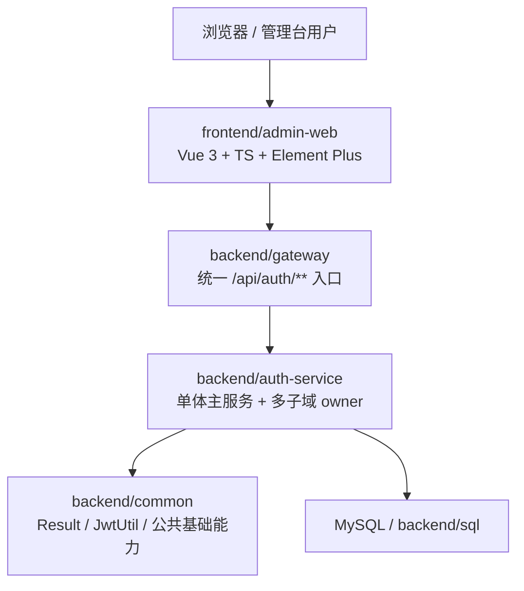
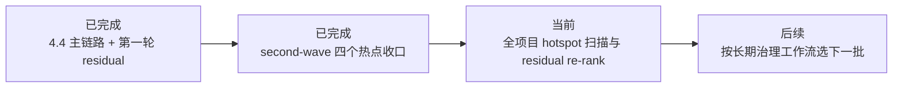

# 财务报销协同系统 - 系统架构设计

版本：V2.1
日期：2026-04-24
说明：本版只做当前仓库事实对齐与文档卫生清理，不再沿用早期 MVP 口径。

## 1. 文档目的

本文档回答三个问题：

1. 当前仓库已经落地成什么结构
2. 当前架构的主要矛盾是什么
3. 下一阶段应该如何继续治理

## 2. 当前系统架构

### 2.1 当前部署视图

```mermaid
flowchart TB
    U["浏览器 / 管理台用户"]
    FE["frontend/admin-web\nVue 3 + TS + Element Plus"]
    GW["backend/gateway\n统一 /api/auth/** 入口"]
    AUTH["backend/auth-service\n单体主服务 + 多子域 owner"]
    CM["backend/common\nResult / JwtUtil / 公共基础能力"]
    DB["MySQL / backend/sql"]

    U --> FE
    FE --> GW
    GW --> AUTH
    AUTH --> CM
    AUTH --> DB
```

### 2.2 当前后端内部结构

`auth-service` 当前已经不是“只做认证”的服务，而是承载多子域的单体主服务：

- `auth`
- `profile`
- `process`
- `async-task`
- `voucher`
- `settings`
- `mvp-dashboard`
- `financesystem`
- `financearchive`
- `expense`
- `fixedasset`
- `expensevoucher`
- `archiveagent`

其中大量历史 mega service 已经被压成 frozen facade / thin coordinator / compatibility facade，再把真相下沉到 owner。

## 3. 当前真实状态判断

### 3.1 已完成的阶段

已完成：

- `4.4` 主链路治理
- finance archive 收口
- expense residual 第一轮收口
- fixed-asset residual 收口
- expense-voucher-generation residual 收口
- archive-agent residual 收口
- second-wave 四个后端热点收口

### 3.2 当前验证基线

- backend：`556/556`
- frontend：`211/211`

### 3.3 当前阶段

当前项目不再处于“从零到 MVP”的阶段，而是处于：

> 模块化单体边界已基本成型，正在持续清理 residual hotspot 与工程漂移的阶段。

## 4. 架构约束

### 4.1 当前不做的事

- 不激进重命名
- 不先拆微服务
- 不回头重打已形成 owner 的大基座，除非复盘再次确认膨胀
- 不因为文档同步而改动业务协议

### 4.2 当前重点做的事

- 继续把残余 hotspot 压成 thin facade / thin coordinator 或清晰 owner
- 保持 controller URL、service 接口、DTO / VO 稳定
- 持续维护 focused tests 与全量回归基线
- 让 README、架构文档、配置说明、执行记录始终和仓库现状一致

## 5. 当前主要差距

与理想的长期蓝图相比，当前真正的差距主要在于：

- 少数大基座仍有二次膨胀风险
- 文档、配置说明、启动链容易出现事实漂移
- 前端大页面与复杂编辑器仍可能形成新的热点
- 热点批次需要靠统一 workflow 持续压制，而不是一次性“重做系统”

## 6. 当前治理结论

second-wave 既定四个后端热点已经全部完成：

1. `ProcessFlowDesignServiceImpl`
2. `ExpensePaymentDomainSupport`
3. `ExpenseRelationWriteOffService`
4. `ExpenseSummaryAssembler`

当前下一步不是继续机械写死新顺位，而是：

- 回到全项目 hotspot 扫描
- 做 backend / frontend / 文档配置三轨 residual re-rank
- 再决定新一轮主批次

## 7. 中短期路线

```mermaid
flowchart LR
    A["已完成\n4.4 主链路 + 第一轮 residual"] --> B["已完成\nsecond-wave 四个热点收口"]
    B --> C["当前\n全项目 hotspot 扫描与 residual re-rank"]
    C --> D["后续\n按长期治理工作流选下一批"]
```

## 8. 结论

当前最重要的架构判断是：

- 系统已经具备较完整的模块化单体骨架
- 当前核心工作不是继续描述早期蓝图，而是持续治理单体内部 hotspot
- 一切“下一批”判断都应以 `执行记录/报销系统治理落地方案.md` 和 `执行记录/2026-04-24_项目长期架构治理工作流.md` 为主基线