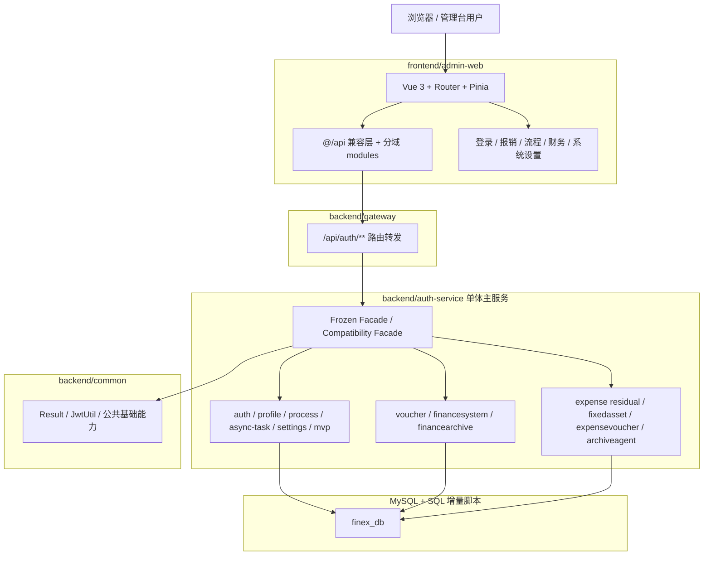
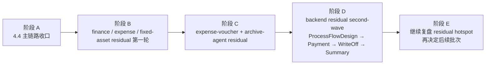

# 当前实现架构图与演进路线图

更新时间：2026-04-11

## 1. 文档目的

这份文档只做一件事：把仓库当前真实状态、当前阶段、以及下一步 residual 路线统一写清楚，避免继续沿用早期“认证骨架 + 前端原型”口径。

本文以当前仓库代码和治理基线为准，不再按早期 MVP 设想描述现状。

## 2. 当前实现架构

### 2.1 真实落地视图



### 2.2 当前仓库结构与职责

```text
报销系统/
├── backend/
│   ├── common/                    # 公共响应、JWT、共享基础能力
│   ├── gateway/                   # 网关与 API 入口
│   ├── auth-service/              # 单体主服务，承载多数业务域
│   └── sql/                       # 初始化、迁移、刷新脚本
├── docs/
│   └── architecture/             # 架构与启动说明
├── frontend/
│   └── admin-web/                # 管理台前端
├── 执行记录/                      # 治理进度与专题规范
└── 当前实现架构图与演进路线图.md
```

### 2.3 当前阶段判断

当前仓库的正确描述是：

- 不是“只有 auth-service 有少量真实逻辑”的早期阶段
- 也不是已经拆成多服务的平台化阶段
- 而是“单体主服务已承载多数业务域，主链路和第一轮热点已收口，正在继续做 residual second-wave”的阶段

当前真实验证基线：

- backend：`297/297`
- frontend：`211/211`

## 3. 当前实现与目标蓝图的差距

### 3.1 已经补齐的部分

- `auth-service` 内部多领域 owner 已基本成型
- 多个历史 mega service 已压成 frozen facade 或 compatibility facade
- finance archive、expense residual、fixed-asset residual、expense-voucher、archive-agent 等主批次已完成第一轮收口
- 前端 `@/api` 兼容层、后端 focused tests、主治理文档基线已经稳定

### 3.2 仍然存在的主要差距

- 单体内部仍有少数 live hotspot 尚未继续下沉 owner
- route / workflow / payment / write-off / summary 等局部真相仍偏集中
- 部分专题文档、配置说明和启动说明曾停留在旧阶段口径，需要持续和仓库同步
- 当前仍不是多服务拆分阶段，主要矛盾仍在单体内部边界治理

## 4. 当前治理阶段

### 4.1 已完成阶段

`4.4` 主链路与第一轮 residual 已完成：

- `process + settings`
- `voucher + finance-context`
- `async-task`
- `profile`
- `auth + mvp-dashboard`
- `finance-system`
- `finance archive`
- `expense residual hotspot`
- `fixed-asset residual`
- `expense-voucher-generation residual`
- `archive-agent residual`

### 4.2 当前阶段

当前处于：`backend residual hotspot second-wave`

本阶段目标不是再造新大基座，而是继续消化仍保留 live truth 的 residual hotspot。

### 4.3 下一批建议顺序

1. `ProcessFlowDesignServiceImpl`
2. `ExpensePaymentDomainSupport`
3. `ExpenseRelationWriteOffService`
4. `ExpenseSummaryAssembler`

## 5. 演进路线图



## 6. 路线约束

- 已冻结 façade 不再回灌新业务真相
- 已形成 owner 的 `Abstract*Support` 大基座暂不回头重打
- 新批次继续遵循“先抽边界、再迁移调用、最后收口旧入口”的三段式推进
- 文档、配置说明、测试基线必须随治理同步更新

## 7. 结论

当前最重要的事实不是“系统还早”，而是“系统已经进入单体内部第二轮 residual 收口”。

因此下一步不应该再用早期 MVP 口径规划仓库，而应以 `执行记录/报销系统治理落地方案.md` 为唯一进度基线，继续按 `ProcessFlowDesignServiceImpl → ExpensePaymentDomainSupport → ExpenseRelationWriteOffService → ExpenseSummaryAssembler` 推进。
