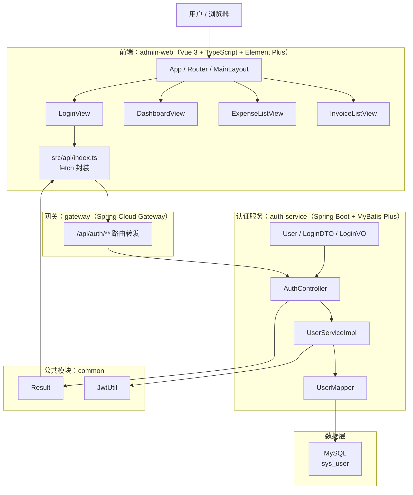
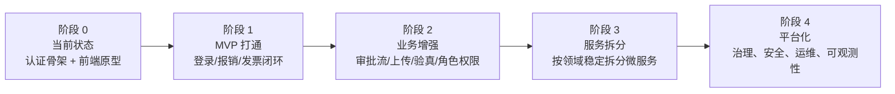
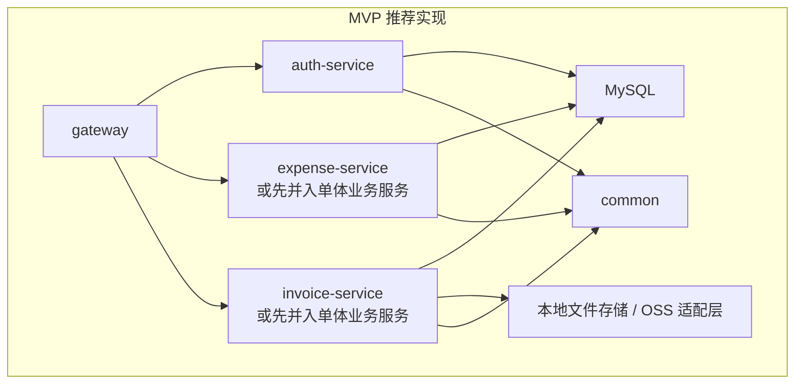
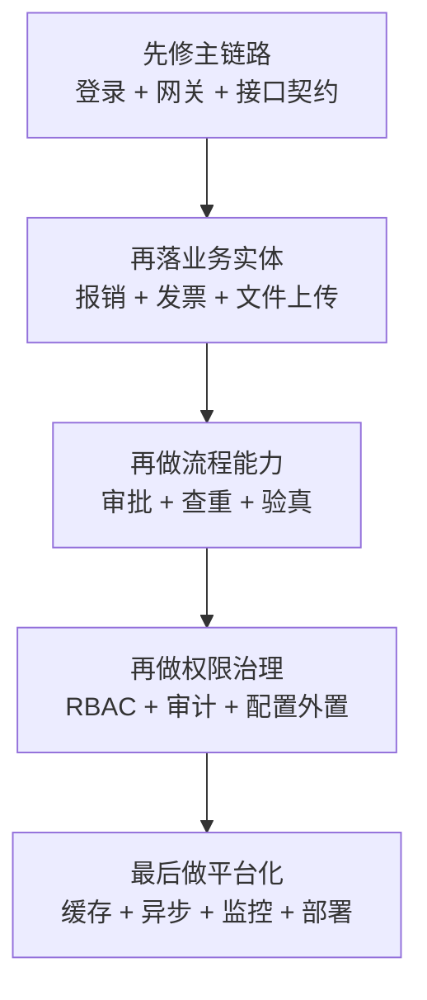

# 当前实现架构图与演进路线图

更新时间：2026-03-24

## 1. 文档目的

这份文档描述两个视角：

1. 当前代码库已经落地的真实实现架构
2. 从当前状态演进到可交付 MVP、再到完整业务平台的建议路线

说明：

- 当前项目是“目标架构很完整，但实际实现仍处于早期阶段”的状态
- 本文以仓库中的真实代码为准，而不是只以设计文档为准

---

## 2. 当前实现架构图

### 2.1 真实落地视图



### 2.2 当前仓库结构与职责

```text
报销系统/
├── docs/
│   └── architecture/
│       └── 系统架构设计.md         # 目标蓝图，范围大于当前实现
├── backend/
│   ├── common/                    # 通用响应、JWT 工具
│   ├── gateway/                   # API 网关，目前只转发认证接口
│   ├── auth-service/              # 当前唯一有业务逻辑的后端服务
│   └── sql/                       # SQL 目录，当前未形成完整服务配套
├── frontend/
│   └── admin-web/                 # 管理后台前端
└── README.md
```

### 2.3 当前实现的分层判断

#### 前端层

- 已有基础壳：应用入口、路由、布局、登录页、首页、报销列表页、发票列表页
- 已有 API 调用封装和路由守卫
- 大部分业务数据仍为页面内静态 mock 数据
- 菜单规模明显大于已实现路由规模

#### 网关层

- 已存在独立网关服务
- 当前仅配置一条认证路由
- 还没有统一鉴权过滤、限流、熔断、服务发现、配置中心等能力

#### 业务服务层

- 只有 `auth-service` 具备真实 controller/service/mapper/entity 结构
- 用户登录流程已形成最小闭环
- 报销、发票、审批、预算、凭证、组织架构等服务尚未真正落地

#### 公共能力层

- 已抽出统一响应结构 `Result`
- 已抽出 JWT 工具 `JwtUtil`
- 还没有统一异常处理、统一日志、统一安全、统一数据库基类等公共中台能力

#### 数据层

- 认证服务使用 MySQL
- 当前显式依赖的真实业务表主要是 `sys_user`
- 文档中规划的 Redis、MongoDB、OSS、MQ、ES 还没有进入代码主路径

---

## 3. 当前实现和目标蓝图的差距

### 3.1 架构层面的差距

| 维度 | 目标状态 | 当前状态 |
|---|---|---|
| 服务数量 | 多业务微服务 | 仅 `auth-service` 真正落地 |
| 网关能力 | 鉴权、限流、治理、统一入口 | 仅基础转发 |
| 数据层 | MySQL + Redis + MongoDB + OSS + MQ + ES | 主要只有 MySQL |
| 前端业务化 | 对接真实 API 的管理台 | 大量静态页面原型 |
| 安全体系 | 密钥外置、权限、审计、加密 | 仍是早期实现 |
| 运维体系 | 容器化、配置中心、注册中心、CI/CD | 设计存在，代码未形成闭环 |

### 3.2 当前最关键的落地阻塞

1. 前后端接口契约和网关转发还没有完全对齐
2. 业务服务尚未按领域拆分落地
3. 前端页面完成度高于后端能力，真实业务闭环不足
4. 安全、配置、异常处理、日志等基础设施还偏原型化

---

## 4. 当前阶段建议的总体策略

不建议一开始就继续横向铺微服务数量。

更稳妥的方式是：

1. 先把“认证 + 报销 + 发票”做成一个可跑通的 MVP 主链路
2. 再补“审批流 + 文件上传 + 查重验真”这些关键能力
3. 最后再考虑拆分更细的服务和引入更多中间件

一句话概括：

先做可用，再做完整，最后做复杂。

---

## 5. 建议演进路线图

### 5.1 演进总图



### 5.2 分阶段路线

#### 阶段 0：当前状态

目标：

- 保持当前仓库可编译、可构建
- 识别所有“界面已做、后端未做”的断点

现状特征：

- 前端页面多，真实 API 少
- 后端只有认证服务形成闭环
- 架构文档领先于代码实现

#### 阶段 1：MVP 打通

目标：

- 形成最小可演示、可联调、可验收的业务闭环

建议范围：

- 登录
- 当前用户信息
- 报销单新增/列表/详情
- 发票上传/列表/关联报销

建议模块组织：



阶段 1 重点事项：

- 修正网关路由与后端真实接口路径
- 统一前后端登录返回结构
- 补真实报销 API，而不是继续堆静态页面
- 菜单、路由、接口、数据库表四者保持一致
- 把敏感配置移到环境变量或配置文件模板

#### 阶段 2：业务增强

目标：

- 让报销系统具备真实业务价值

建议建设项：

- 审批流引擎接入
- 发票附件上传
- 发票查重规则
- 发票验真异步化
- 组织、用户、角色、权限
- 操作日志与审计日志

建议架构变化：

- 引入 Redis 做 token、验证码、热点缓存、幂等控制
- 引入异步任务机制处理 OCR、验真、通知
- 增加统一异常处理、统一日志 Trace、统一鉴权拦截器

#### 阶段 3：服务拆分

目标：

- 在业务模型稳定后再做合理微服务拆分

建议拆分顺序：

1. `auth-service`
2. `expense-service`
3. `invoice-service`
4. `approval-service`
5. `user-service`

不建议过早拆分的原因：

- 当前业务边界还在变化
- 先拆会增加接口治理、事务一致性、联调成本
- 团队规模不足时，过细拆分会拖慢开发速度

建议判断“是否该拆”的标准：

- 数据模型稳定
- 接口边界稳定
- 模块由不同成员独立维护
- 已经出现单服务变更冲突、部署风险或性能瓶颈

#### 阶段 4：平台化与生产化

目标：

- 从“能用”升级到“可上线、可维护、可审计”

建议建设项：

- 配置中心
- 注册发现
- 限流熔断
- 链路追踪
- 指标监控
- 日志集中采集
- CI/CD
- Docker / K8s 部署
- 灰度发布
- 数据备份与恢复

---

## 6. 推荐的目标架构落地顺序

### 6.1 推荐顺序图



### 6.2 为什么这样排

- 先修主链路，能最快把系统从“展示型原型”变成“可交互产品”
- 先做业务，再做治理，避免基础设施先行导致投入分散
- 先稳定领域边界，再做微服务拆分，避免返工

---

## 7. 建议的里程碑版本

### V0.1：可联调版本

包含：

- 登录打通
- 菜单和路由对齐
- 首页改为真实接口数据
- 报销列表、发票列表改为真实接口

### V0.2：MVP 版本

包含：

- 报销单新增、保存草稿、提交
- 发票上传、发票列表、关联报销
- 基础权限控制

### V0.3：业务可用版本

包含：

- 审批流
- 发票查重
- 验真任务异步化
- 操作日志

### V1.0：生产准备版本

包含：

- 统一配置与密钥管理
- 缓存与异步组件
- 监控、日志、告警
- 部署、备份、运维手册

---

## 8. 当前最值得优先处理的 10 件事

1. 修正网关和认证服务的实际转发路径
2. 统一登录接口返回结构
3. 前端退出登录时清理 token 和用户信息
4. 把硬编码数据库密码、JWT 密钥迁出代码
5. 增加全局异常处理，避免控制器内手动 try/catch 泛滥
6. 为报销和发票建立真实后端模块或最小业务服务
7. 把前端静态 mock 数据替换为真实 API
8. 对齐菜单、路由、页面、接口四套结构
9. 引入基础 RBAC 权限模型
10. 为附件上传、发票查重、审批流程预留标准接口

---

## 9. 结论

当前项目的优势是：

- 蓝图完整
- 技术选型统一
- 前后端骨架已经成型

当前项目的核心问题是：

- 真实业务落地深度不足
- 架构目标和代码现状差距较大
- 基础设施和安全能力还处于原型阶段

最合理的推进策略不是继续横向铺页面或铺服务，而是围绕一条主业务线逐步打通：

登录 -> 报销 -> 发票 -> 审批 -> 治理 -> 平台化

这样可以让项目尽快从“设计很好”走到“产品可用”。
