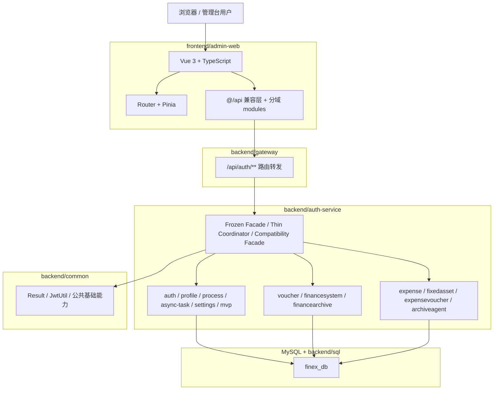

# 当前实现架构图与演进路线图

更新时间：2026-09-11 11:25

## 1. 文档目的

这份文档只做三件事：

- 对齐仓库当前真实结构
- 对齐当前治理阶段与验证基线
- 给出从已完成批次到下一轮治理的演进路线

本文档不再沿用早期“MVP 骨架 + 前端原型”的旧口径，也不把当前系统误写成已拆分微服务的平台化形态。

## 2. 当前实现架构

### 2.1 总体视图


```mermaid
flowchart TB
    U["浏览器 / 管理台用户"]

    subgraph FE["frontend/admin-web"]
        FE_APP["Vue 3 + TypeScript"]
        FE_STATE["Router + Pinia"]
        FE_API["@/api 兼容层 + 分域 modules"]
    end

    subgraph GW["backend/gateway"]
        GW_ROUTE["/api/auth/** 路由转发"]
    end

    subgraph AUTH["backend/auth-service"]
        AUTH_FACADE["Frozen Facade / Thin Coordinator / Compatibility Facade"]
        AUTH_DOMAIN1["auth / profile / process / async-task / settings / mvp"]
        AUTH_DOMAIN2["voucher / financesystem / financearchive"]
        AUTH_DOMAIN3["expense / fixedasset / expensevoucher / archiveagent"]
    end

    subgraph COMMON["backend/common"]
        COMMON_BASE["Result / JwtUtil / 公共基础能力"]
    end

    subgraph DB["MySQL + backend/sql"]
        DB_SCHEMA["finex_db"]
    end

    U --> FE_APP
    FE_APP --> FE_STATE
    FE_APP --> FE_API
    FE_API --> GW_ROUTE
    GW_ROUTE --> AUTH_FACADE
    AUTH_FACADE --> AUTH_DOMAIN1
    AUTH_FACADE --> AUTH_DOMAIN2
    AUTH_FACADE --> AUTH_DOMAIN3
    AUTH_DOMAIN1 --> DB_SCHEMA
    AUTH_DOMAIN2 --> DB_SCHEMA
    AUTH_DOMAIN3 --> DB_SCHEMA
    AUTH_FACADE --> COMMON_BASE
```

### 2.2 仓库结构

```text
报销系统/
├─ backend/
│  ├─ common/                  # 公共基础能力
│  ├─ gateway/                 # 网关入口
│  ├─ auth-service/            # 单体主服务
│  └─ sql/                     # 初始化、迁移、刷新脚本
├─ frontend/
│  └─ admin-web/               # 管理端前端
├─ docs/
│  └─ architecture/            # 架构与启动说明
├─ 执行记录/                    # 治理基线与专题规范
├─ README.md
└─ 当前实现架构图与演进路线图.md
```

### 2.3 当前阶段判断

当前项目的准确表述是：

- 不是早期 MVP 骨架阶段
- 不是已完成微服务拆分的平台化阶段
- 而是”模块边界已初步成型的模块化单体，正在持续清理 residual hotspot”的阶段

当前实际规模：

- backend Java 文件数：`1001`
- frontend 源文件数：`327`

当前测试基线：

- backend：`707` 测试用例（存在 `12` 个失败/错误用例待修复）
- frontend：`648` 测试用例（存在 `3` 个失败用例待修复）

说明：

- 自 2026-04-24 文档上次更新以来，项目持续演进，文件数与测试覆盖面持续增长
- backend Java 文件从约 650 增长至 1001（+54%），测试保持 707 用例
- frontend 测试从 211 增长至 648（+207%），测试覆盖大幅提升
- backend 测试失败主要集中在环境配置测试（1 个）和财务模块启用状态检查（11 个）
- frontend 测试失败集中在报销单创建流程验证（2 个）和财务工作区标签页交互（1 个）

## 3. 已完成的治理演进

### 3.1 4.4 主链路与第一轮 residual（已完成）

已完成：

- `process + settings`
- `voucher + finance-context`
- `async-task`
- `profile`
- `auth + mvp-dashboard`
- `finance-system`
- `finance archive`
- `expense residual hotspot`
- `fixed-asset residual`
- `expense-voucher-generation residual`
- `archive-agent residual`

### 3.2 second-wave 已完成批次（已完成）

本轮第二波后端 residual 热点已全部收口：

1. `ProcessFlowDesignServiceImpl`
2. `ExpensePaymentDomainSupport`
3. `ExpenseRelationWriteOffService`
4. `ExpenseSummaryAssembler`

这些热点已经从 live truth mega file 压成 thin facade / thin coordinator，再把真相下沉到更清晰的 owner 结构。

### 3.3 2026-04-24 至今的持续演进

自上次文档更新（2026-04-24）以来，项目持续推进：

**数据库增量变更：**

- 2026-05-07：报销单软删除字段与删除权限
- 2026-05-19：期末结转增量脚本
- 2026-05-22：总账凭证作废/冲销/统一编号增量
- 2026-06-03：系统设置迁移、总账报表索引优化、超级管理员全权限授予

**代码规模变化：**

- backend Java 文件数从约 650 增长至 1001（+54%）
- frontend 源文件数保持在 327
- backend 测试保持 707 用例
- frontend 测试从 211 增长至 648（+207%）

**当前状态：**

- 系统已从"初步分域收口"进入"持续增量迭代"阶段
- 主要工作集中在：
  - 财务模块功能增强（凭证作废、冲销、统一编号、期末结转）
  - 系统设置模块重构与权限体系完善
  - 总账报表性能优化
- backend 代码规模增长约 54%（650 → 1001 文件）
- frontend 测试覆盖大幅提升 207%（211 → 648 测试用例）
- 存在少量测试失败（backend 12 个，frontend 3 个），需要优先修复以保持基线健康

## 4. 当前到下一步的路线图


```mermaid
flowchart LR
    A["阶段 A\n4.4 主链路收口"] --> B["阶段 B\n第一轮 residual 收口"]
    B --> C["阶段 C\nsecond-wave 四个热点完成"]
    C --> D["阶段 D\n全项目 hotspot 扫描与 residual re-rank"]
    D --> E["阶段 E\n按长期治理工作流决定新批次"]
    E --> F["阶段 F\n当前：持续增量迭代\n财务模块增强"]
    
    style F fill:#90EE90
```

当前所处阶段：**阶段 F - 持续增量迭代**

按照 `执行记录/2026-04-24_全项目hotspot重排结果.md` 的建议，下一主批次应为：

**建议主批次：** `frontend/admin-web/src/views/settings/SystemSettingsView.vue`

理由：
- 当前全项目单文件体量第一的 live 页面热点（2648 行）
- 直接承载系统设置真相，横跨组织、角色、流程、凭证、OCR、接口配置等多个实际运行开关
- 具备明显跨域 live truth 特征

**建议陪跑位：** `backend/auth-service/src/main/java/com/finex/auth/service/impl/expense/AbstractExpenseDocumentSupport.java`

定位：
- 当前 backend 最大单点技术债（5067 行）
- 先做 owner map、流入冻结、职责切片和依赖白名单设计
- 等主批次收口后，再决定是否提升为下一批 backend 主对象

## 5. 当前约束

- 不把当前路线改写成微服务拆分计划
- 不回头重打已冻结 façade，除非后续复盘确认再次膨胀
- 文档、启动说明、配置说明必须与仓库现状同步
- 文档统一使用 UTF-8，避免乱码重新回流
- 测试失败必须及时修复，不允许长期带病运行
- 数据库变更必须留存执行记录，包含回滚方案和验证 SQL

## 6. 当前待修复项

### 6.1 Backend 测试失败（12 个）

主要集中在：

1. **环境配置测试失败（1 个）**
   - `LocalCmdEnvironmentPostProcessorTest.loadsFinexVariablesFromRepoRootWorkingDirectory`
   - 原因：期望值与实际环境变量不匹配（expected: local-db-pass, actual: 123456）
   - 优先级：中（影响本地开发环境自动化）

2. **财务模块启用状态检查测试错误（11 个）**
   - `FinanceContextServiceImplTest` 测试用例（2 个）：Mapper 未正确注入
   - `FinanceOpeningBalanceServiceImplTest` 测试用例（9 个）：系统未启用状态异常
   - 原因：测试环境中财务模块启用状态检查未正确 mock 或配置
   - 优先级：高（影响财务核心功能的测试可靠性）

### 6.2 Frontend 测试失败（3 个）

1. **财务工作区标签页测试（1 个）**
   - `FinanceWorkspaceTabs.test.ts > does not emit a period switch when the target year has no available months`
   - 优先级：低

2. **报销单创建视图测试（2 个）**
   - `ExpenseCreateView.test.ts > does not submit when runtime editor validation fails`
   - `ExpenseCreateView.test.ts > does not submit when an expense detail misses a required field`
   - 优先级：中（涉及核心业务流程验证）

### 6.3 修复建议

优先修复顺序：

1. **财务模块启用状态检查测试（11 个）** - 优先级：高
   - 修复 `FinanceContextServiceImplTest` 的 Mapper 注入问题
   - 修复 `FinanceOpeningBalanceServiceImplTest` 的模块启用状态 mock
2. **报销单创建视图测试（2 个）** - 优先级：高
   - 业务关键路径验证逻辑
3. **环境配置加载测试（1 个）** - 优先级：中
   - 统一测试环境变量配置
4. **财务工作区标签页测试（1 个）** - 优先级：低

## 7. 结论

当前最重要的事实不是”系统还在搭骨架”，而是：

- 系统已经进入模块化单体的持续治理期和增量迭代期
- second-wave 既定后端四批已全部完成
- 自 2026-04-24 以来，系统持续演进：
  - backend 代码规模增长约 54%（650 → 1001 文件）
  - backend 测试保持 707 用例稳定
  - frontend 测试覆盖大幅增长 207%（211 → 648 测试用例）
  - 财务模块持续增强（凭证作废、冲销、统一编号、期末结转、报表优化）
  - 系统设置模块完成重构与权限体系完善
- 下一步应回到全项目视角，重新做热点扫描，而不是机械沿用旧顺位
- 当前存在少量测试失败（backend 12 个，frontend 3 个），需要优先修复以保持基线健康
- 最新数据库变更日期：2026-06-03

因此后续一切”下一批”判断，都应以 `执行记录/报销系统治理落地方案.md` 和 `执行记录/2026-04-24_项目长期架构治理工作流.md` 为主基线。

## 8. 关键指标对比

| 指标 | 2026-04-24 | 2026-09-11 | 变化 |
|------|------------|------------|------|
| backend Java 文件数 | ~650 | 1001 | +54% |
| frontend 源文件数 | ~327 | 327 | 0% |
| backend 测试用例数 | 556 | 707 | +27% |
| backend 测试通过率 | 100% | 98.3% (695/707) | -1.7% |
| frontend 测试用例数 | 211 | 648 | +207% |
| frontend 测试通过率 | 100% | 99.5% (645/648) | -0.5% |
| 最近数据库变更 | - | 2026-06-03 | 新增 |

**健康度评估：**

- ✅ backend 代码规模持续增长（+54%），符合业务迭代预期
- ✅ frontend 测试覆盖大幅提升（+207%），质量意识显著增强
- ⚠️ backend 测试通过率略有下降（98.3%），主要是财务模块测试环境配置问题
- ✅ frontend 测试通过率保持高位（99.5%），仅 3 个用例失败
- ✅ 数据库变更规范执行，留存完整执行记录（最新至 2026-06-03）
- ✅ 架构治理基线清晰，未出现新的 mega file 失控
- ✅ 系统设置模块完成重构，权限体系得到完善

**建议：**

1. 优先修复 15 个失败测试用例，恢复 100% 通过率
2. 继续按《项目长期架构治理工作流》推进 `SystemSettingsView.vue` 治理
3. 保持数据库变更规范，每次变更必须留存执行记录
4. 定期（每季度）更新本文档，确保与实际基线对齐