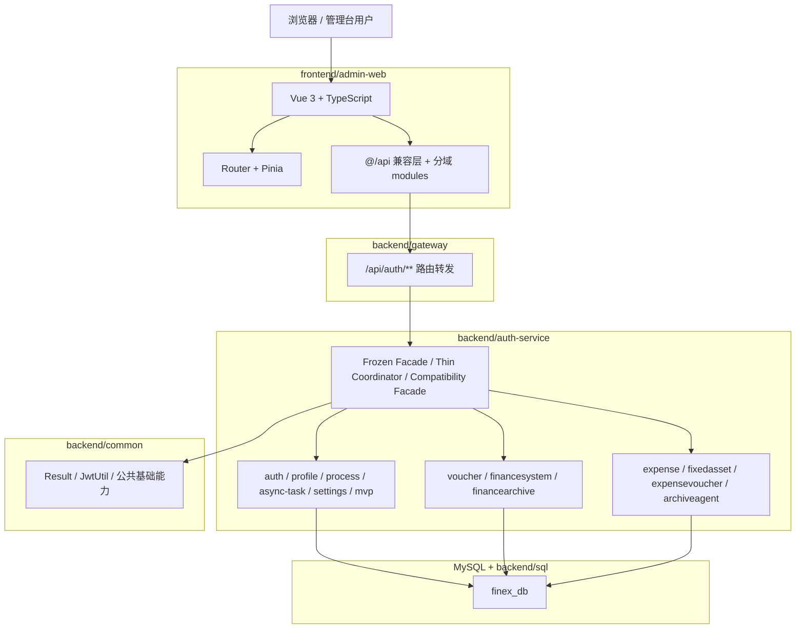
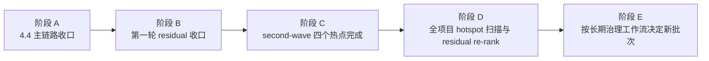

# 当前实现架构图与演进路线图

更新时间：2026-04-24

## 1. 文档目的

这份文档只做三件事：

- 对齐仓库当前真实结构
- 对齐当前治理阶段与验证基线
- 给出从已完成批次到下一轮治理的演进路线

本文档不再沿用早期“MVP 骨架 + 前端原型”的旧口径，也不把当前系统误写成已拆分微服务的平台化形态。

## 2. 当前实现架构

### 2.1 总体视图


```mermaid
flowchart TB
    U["浏览器 / 管理台用户"]

    subgraph FE["frontend/admin-web"]
        FE_APP["Vue 3 + TypeScript"]
        FE_STATE["Router + Pinia"]
        FE_API["@/api 兼容层 + 分域 modules"]
    end

    subgraph GW["backend/gateway"]
        GW_ROUTE["/api/auth/** 路由转发"]
    end

    subgraph AUTH["backend/auth-service"]
        AUTH_FACADE["Frozen Facade / Thin Coordinator / Compatibility Facade"]
        AUTH_DOMAIN1["auth / profile / process / async-task / settings / mvp"]
        AUTH_DOMAIN2["voucher / financesystem / financearchive"]
        AUTH_DOMAIN3["expense / fixedasset / expensevoucher / archiveagent"]
    end

    subgraph COMMON["backend/common"]
        COMMON_BASE["Result / JwtUtil / 公共基础能力"]
    end

    subgraph DB["MySQL + backend/sql"]
        DB_SCHEMA["finex_db"]
    end

    U --> FE_APP
    FE_APP --> FE_STATE
    FE_APP --> FE_API
    FE_API --> GW_ROUTE
    GW_ROUTE --> AUTH_FACADE
    AUTH_FACADE --> AUTH_DOMAIN1
    AUTH_FACADE --> AUTH_DOMAIN2
    AUTH_FACADE --> AUTH_DOMAIN3
    AUTH_DOMAIN1 --> DB_SCHEMA
    AUTH_DOMAIN2 --> DB_SCHEMA
    AUTH_DOMAIN3 --> DB_SCHEMA
    AUTH_FACADE --> COMMON_BASE
```

### 2.2 仓库结构

```text
报销系统/
├─ backend/
│  ├─ common/                  # 公共基础能力
│  ├─ gateway/                 # 网关入口
│  ├─ auth-service/            # 单体主服务
│  └─ sql/                     # 初始化、迁移、刷新脚本
├─ frontend/
│  └─ admin-web/               # 管理端前端
├─ docs/
│  └─ architecture/            # 架构与启动说明
├─ 执行记录/                    # 治理基线与专题规范
├─ README.md
└─ 当前实现架构图与演进路线图.md
```

### 2.3 当前阶段判断

当前项目的准确表述是：

- 不是早期 MVP 骨架阶段
- 不是已完成微服务拆分的平台化阶段
- 而是“模块边界已初步成型的模块化单体，正在持续清理 residual hotspot”的阶段

当前验证基线：

- backend：`556/556`
- frontend：`211/211`

## 3. 已完成的治理演进

### 3.1 4.4 主链路与第一轮 residual

已完成：

- `process + settings`
- `voucher + finance-context`
- `async-task`
- `profile`
- `auth + mvp-dashboard`
- `finance-system`
- `finance archive`
- `expense residual hotspot`
- `fixed-asset residual`
- `expense-voucher-generation residual`
- `archive-agent residual`

### 3.2 second-wave 已完成批次

本轮第二波后端 residual 热点已全部收口：

1. `ProcessFlowDesignServiceImpl`
2. `ExpensePaymentDomainSupport`
3. `ExpenseRelationWriteOffService`
4. `ExpenseSummaryAssembler`

这些热点已经从 live truth mega file 压成 thin facade / thin coordinator，再把真相下沉到更清晰的 owner 结构。

## 4. 当前到下一步的路线图


```mermaid
flowchart LR
    A["阶段 A\n4.4 主链路收口"] --> B["阶段 B\n第一轮 residual 收口"]
    B --> C["阶段 C\nsecond-wave 四个热点完成"]
    C --> D["阶段 D\n全项目 hotspot 扫描与 residual re-rank"]
    D --> E["阶段 E\n按长期治理工作流决定新批次"]
```

## 5. 当前约束

- 不把当前路线改写成微服务拆分计划
- 不回头重打已冻结 façade，除非后续复盘确认再次膨胀
- 文档、启动说明、配置说明必须与仓库现状同步
- 文档统一使用 UTF-8，避免乱码重新回流

## 6. 结论

当前最重要的事实不是“系统还在搭骨架”，而是：

- 系统已经进入模块化单体的持续治理期
- second-wave 既定后端四批已全部完成
- 下一步应回到全项目视角，重新做热点扫描，而不是机械沿用旧顺位

因此后续一切“下一批”判断，都应以 `执行记录/报销系统治理落地方案.md` 和 `执行记录/2026-04-24_项目长期架构治理工作流.md` 为主基线。