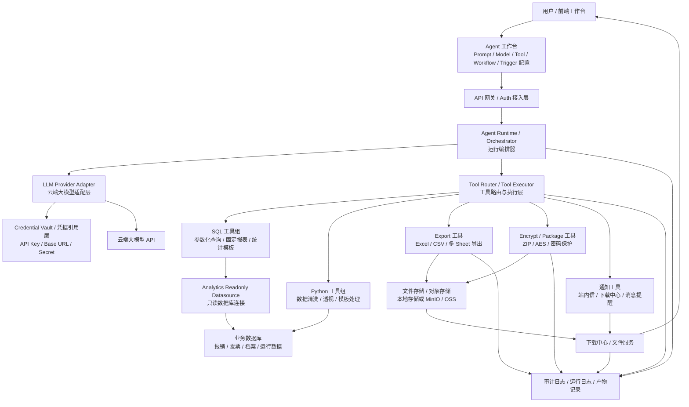
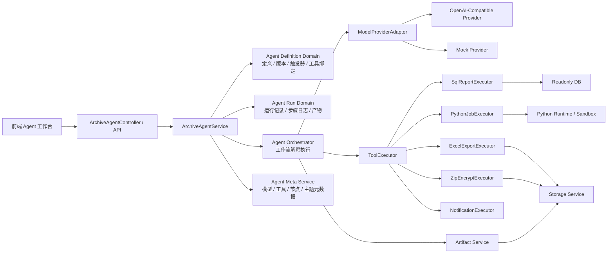
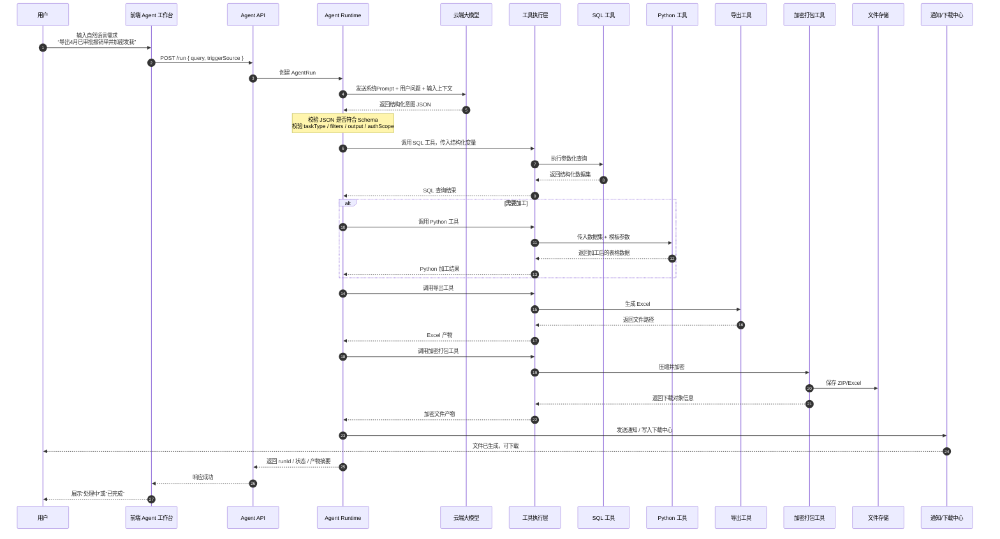
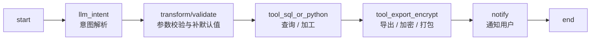
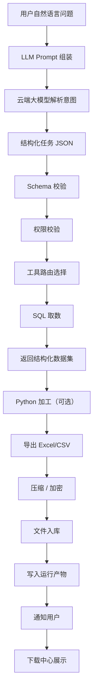
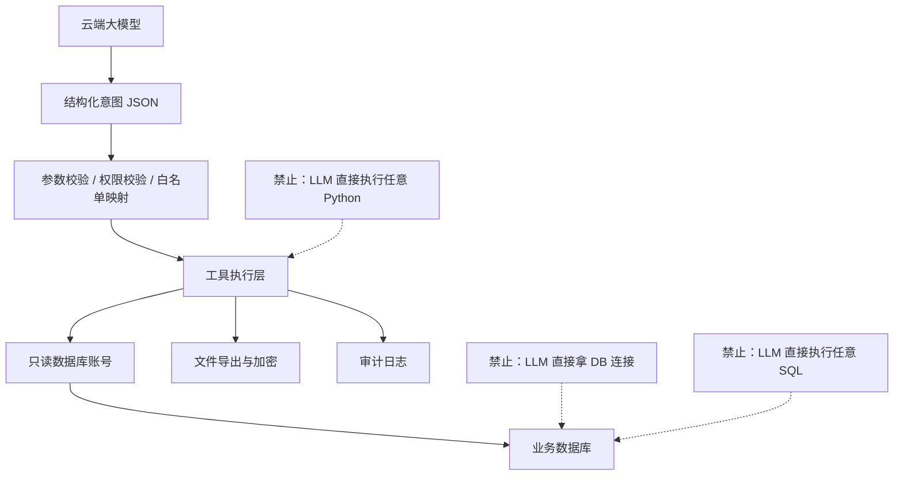

# Agent 云模型导出方案系统架构图与执行链路图


目标场景：

- 接入云端大模型
- 大模型负责理解用户意图
- 输出结构化变量
- 调用已经做好的工具：SQL / Python / 导出 / 加密
- 去数据库取数
- 生成 Excel 或压缩包
- 最终把结果安全交给用户

整体原则：

- LLM 不直接碰数据库
- LLM 不直接执行任意代码
- LLM 只做“规划器 / 参数生成器”
- 工具层才是真正执行者
- Agent Runtime 负责把整条链路串起来
- 文件产物和下载能力独立出来，便于加密、审计、过期控制

---

## 一、目标系统架构图



---

## 二、架构角色说明

- `Agent 工作台`
  - 负责配置 Agent
  - 包含 Prompt、模型、工具、工作流、触发器、调试输入
- `Agent Runtime / Orchestrator`
  - 是整套系统的大脑，不是 LLM
  - 它决定什么时候调模型、什么时候调工具、什么时候结束
- `LLM Provider Adapter`
  - 屏蔽不同云模型供应商差异
  - 例如 OpenAI、Azure OpenAI、OpenAI 兼容网关
- `Credential Vault`
  - 保存 API Key、Base URL、密钥引用
  - Agent 只引用 `credentialCode`，不直接存明文
- `Tool Router / Tool Executor`
  - 统一调度 SQL / Python / Export / Encrypt / Notify 工具
- `SQL 工具组`
  - 只负责只读取数
  - 最好只接参数化查询和报表模板
- `Python 工具组`
  - 负责复杂数据清洗、透视、格式转换
  - 不建议一开始就支持“任意 Python”
- `Export 工具`
  - 负责生成 Excel / CSV
- `Encrypt / Package 工具`
  - 负责压缩、加密、打包
- `下载中心 / 文件服务`
  - 给用户一个统一的下载入口
- `审计日志`
  - 记录谁导出了什么、用了什么条件、生成了什么文件

---

## 三、推荐的内部分层图



---

## 四、核心执行链路图



---

## 五、建议的大模型输出结构

不要让模型输出 SQL，也不要让模型输出 Python。
要让它输出“任务意图 JSON”。

推荐形态：

```json
{
  "taskType": "EXPORT_EXPENSE_REPORT",
  "subject": "expense_documents",
  "intent": "export_report",
  "filters": {
    "dateFrom": "2026-04-01",
    "dateTo": "2026-04-30",
    "statusList": ["APPROVED"],
    "companyId": "C001"
  },
  "groupBy": [],
  "columns": [
    "documentCode",
    "applicantName",
    "departmentName",
    "totalAmount",
    "approvedAt"
  ],
  "postProcess": {
    "sortBy": "approvedAt",
    "sortOrder": "desc"
  },
  "output": {
    "format": "xlsx",
    "encrypt": true,
    "zip": true,
    "fileName": "2026年4月已审批报销单.xlsx"
  }
}
```

这个 JSON 的价值：

- LLM 只负责“理解”
- Runtime 负责“校验”
- Tool 负责“执行”

---

## 六、推荐的工作流节点



每段职责：

- `llm_intent`
  - 把自然语言转成结构化参数
- `transform/validate`
  - 统一补默认值
  - 校验字段合法性
- `tool_sql_or_python`
  - 先查库，再按需加工
- `tool_export_encrypt`
  - 生成文件并加密
- `notify`
  - 通知用户下载

---

## 七、工具层建议拆分

### 1. SQL 查询工具

适合：

- 明细查询
- 汇总统计
- 报表取数

建议工具名：

- `sql.report.expense_detail`
- `sql.report.expense_summary`
- `sql.report.invoice_summary`
- `sql.report.archive_lookup`

输入：

- 筛选条件
- 排序条件
- limit
- 输出列

输出：

- `rows`
- `count`
- `summary`

### 2. Python 加工工具

适合：

- 透视表
- 分组汇总
- 多 Sheet 结构整理
- 特殊格式清洗

建议工具名：

- `python.dataset.pivot`
- `python.dataset.normalize`
- `python.dataset.merge_sheets`

输入：

- 数据集
- 模板参数

输出：

- 加工后的结构化表格数据

### 3. 导出工具

适合：

- Excel
- CSV
- 多 Sheet

建议工具名：

- `export.excel`
- `export.csv`

输入：

- sheet 数据
- 文件名
- 模板名

输出：

- 文件路径
- 文件大小
- 文件摘要

### 4. 加密/打包工具

适合：

- ZIP
- 密码保护
- 多文件归档

建议工具名：

- `package.zip_encrypt`

输入：

- 文件路径列表
- 压缩文件名
- 加密策略

输出：

- 下载对象 ID
- 存储路径
- 下载链接
- 过期时间

---

## 八、完整数据流图



---

## 九、安全边界图



核心安全结论：

- 大模型只能出参数，不能直接操作系统
- 工具只能执行白名单能力，不能任意扩权
- 数据库必须走只读连接和审计记录

---

## 十、当前框架仍需补齐的模块

如果按“目前只有框架，还不够”的状态看，后续需要补的核心模块大概是：

- `真实云模型适配器`
  - OpenAI-compatible provider
- `凭据管理`
  - API Key / Base URL / credentialCode
- `意图输出 JSON Schema`
  - 固定任务协议
- `SQL 报表工具`
  - 参数化查询模板
- `Python 加工工具`
  - 预置脚本执行器
- `导出工具`
  - Excel 生成
- `加密打包工具`
  - ZIP + 密码保护
- `产物中心`
  - 文件存储 / 下载中心 / 过期清理
- `审计日志`
  - 谁查了什么、导出了什么

---

## 十一、推荐首版 MVP 闭环

建议首版只做这一条：


首版先做到：

- 1 个云模型
- 1 套结构化意图协议
- 2~3 个 SQL 报表工具
- 1 个 Excel 导出器
- 1 个 ZIP 加密器
- 1 个下载中心入口

这样最容易真正跑通。

---

## 十二、建议的产物对象模型

建议每次执行最终形成 3 类结果：

- `AgentRun`
  - 这次任务总状态
- `AgentRunStep`
  - 每一步做了什么
- `AgentRunArtifact`
  - 输出文件、Excel、ZIP、下载链接

示例 artifact：

```json
{
  "artifactType": "ZIP_FILE",
  "artifactName": "2026年4月已审批报销单.zip",
  "storageKey": "agent-artifacts/2026/04/26/run-1001/report.zip",
  "fileSize": 245871,
  "encrypted": true,
  "downloadUrl": "/auth/files/agent-artifacts/1001",
  "expiresAt": "2026-04-27 13:00:00"
}
```

---

## 十三、总结

这套方案的核心不是“让大模型直接连数据库”，而是：

- 大模型理解用户意图
- 输出结构化任务变量
- 工具层负责查询、加工、导出、加密
- 平台层负责权限、审计、异步和文件交付

一句话概括：

> LLM 负责决策表达，Tool 负责真实执行，Runtime 负责安全编排。